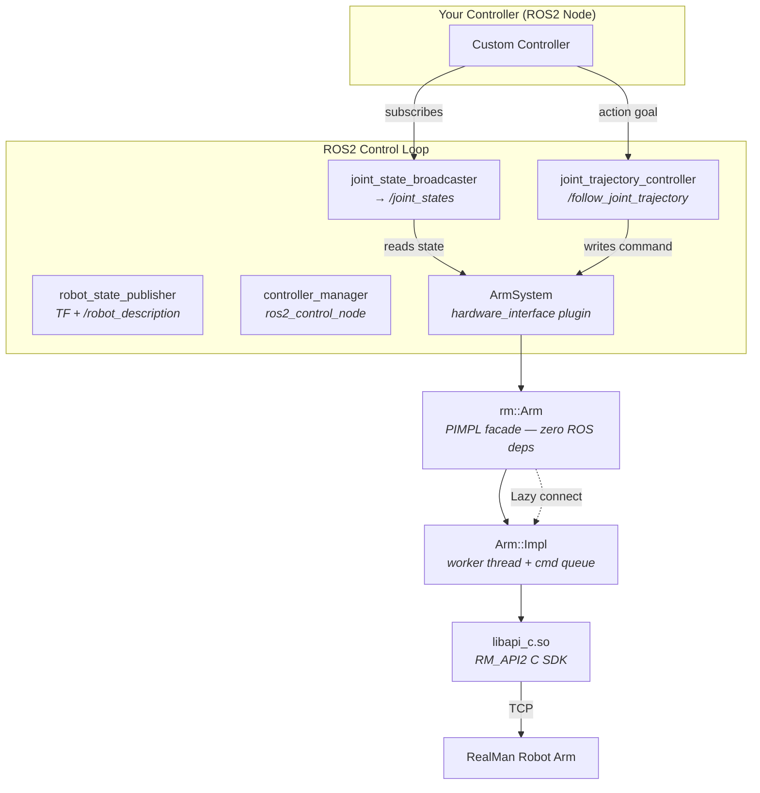
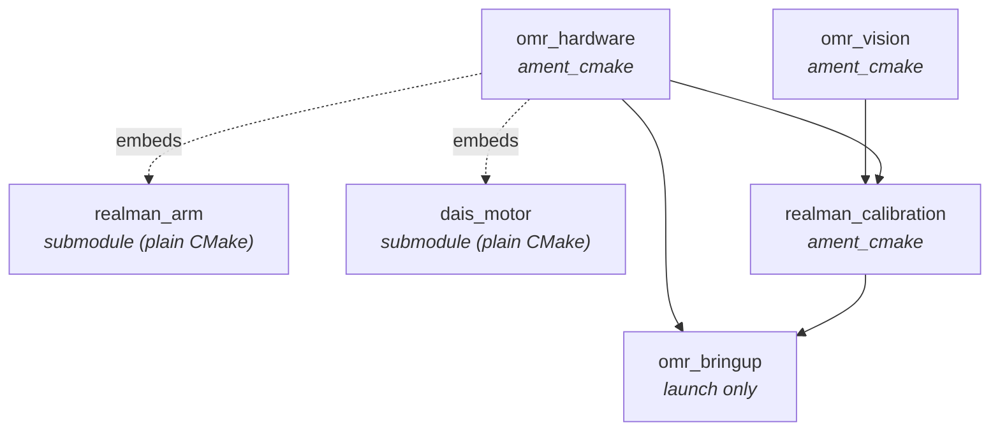
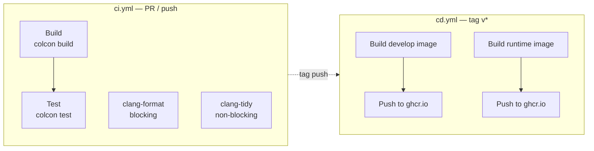
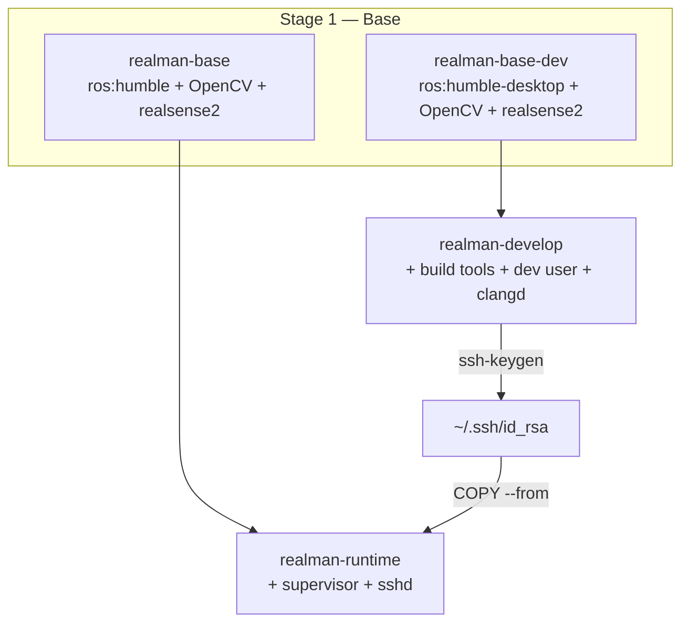

# RealMan Robot Arm — ROS2 Workspace

ROS2 Humble workspace for controlling [RealMan](https://www.realman-robot.com/) robot arms
(RM65, RM75, ECO65, ECO63, RML63, RML63-III, GEN72, GEN72-II) via the official RM_API2 SDK.

## Prerequisites

- **Ubuntu 22.04** (Jammy)
- **ROS2 Humble** — [install guide](https://docs.ros.org/en/humble/Installation.html)
- **Git** + **SSH key** registered with GitHub (private submodules under `omr_hardware/third_party/` use SSH)

Check your ROS2 setup:

```bash
source /opt/ros/humble/setup.bash
ros2 --version
```

## Quick Start

```bash
# 1. Clone with submodule
git clone --recurse-submodules git@github.com:ChiefTechLabs/pipeline.git
cd pipeline

# 2. Build
source /opt/ros/humble/setup.bash
colcon build

# 3. Launch the ros2_control pipeline
source install/setup.bash
ros2 launch omr_bringup bringup.launch.py arm_ip:=192.168.1.18

# Arm examples removed; use ros2_control pipeline instead
```

## Project Structure

```
pipeline/                            # ROS2 workspace root
├── src/
│   ├── omr_vision/                   # ament_cmake — RealSense D435 capture (no ROS deps)
│   │   ├── include/omr_vision/
│   │   │   ├── camera/               #   CameraStream, CameraConfig
│   │   │   └── capture.hpp           #   Capture abstraction
│   │   ├── src/
│   │   ├── CMakeLists.txt
│   │   └── package.xml
│   ├── realman_calibration/          # ament_cmake — hand-eye calibration
│   │   ├── include/realman_calibration/
│   │   ├── src/
│   │   ├── apps/                     # Pipeline executables + calib_node
│   │   ├── config/                   # Board config YAML
│   │   ├── launch/
│   │   ├── test/                     # Comprehensive test suite
│   │   ├── CMakeLists.txt
│   │   └── package.xml
│   ├── omr_hardware/                 # ament_cmake — ros2_control plugins
│   │   ├── third_party/
│   │   │   ├── realman_arm/          #   Git submodule — pure C++ arm control (zero ROS deps)
│   │   │   │   └── third_party/RM_API2/  # Nested submodule — RealMan C SDK
│   │   │   └── dais_motor/           #   Git submodule — pure C++ Modbus RTU driver (zero ROS deps)
│   │   ├── include/omr_hardware/
│   │   │   ├── arm_system.hpp        #   ArmSystem plugin (wraps rm::Arm)
│   │   │   └── dais_hardware.hpp     #   DaisHardware plugin (wraps dais::Motor)
│   │   ├── src/
│   │   │   ├── arm_system.cpp
│   │   │   └── dais_hardware.cpp
│   │   ├── plugins.xml               #   ArmSystem + DaisHardware registration
│   │   ├── CMakeLists.txt
│   │   └── package.xml
│   └── omr_bringup/                  # ament_cmake — launch + config + URDF (no compiled code)
│       ├── launch/
│       │   ├── bringup.launch.py      #   ros2_control pipeline (RSP + CM + JSB + JTC + camera + calib)
│       │   └── calibration.launch.py
│       ├── config/
│       │   └── realman_controllers.yaml  # JSB + JTC config (100Hz, open-loop)
│       ├── urdf/
│       │   ├── realman.urdf.xacro     #   Main entry (kinematics + ros2_control)
│       │   ├── realman.ros2_control.xacro  # <ros2_control> wrapper for ArmSystem
│       │   ├── rm_65.urdf.xacro       #   Vendored upstream RM65 kinematics
│       │   └── meshes/rm_65_arm/      #   STL meshes
│       ├── CMakeLists.txt
│       └── package.xml
├── .github/workflows/                 # CI/CD pipelines
│   ├── ci.yml                          #   Build, test, lint on PR/push
│   └── cd.yml                          #   Docker image publish on tag
├── cmake/                              # Shared CMake modules (clang_tidy.cmake, etc.)
├── scripts/                          # Deployment scripts
│   ├── deploy-remote                 #   Sync + restart services on robot
│   ├── sync-remote                   #   Rsync install/ to runtime container
│   ├── ssh-remote                    #   SSH into runtime (port 2022)
│   ├── build-local                   #   Build workspace + compile_commands
│   ├── generate-compile-commands.sh  #   Merge clangd compile_commands.json
│   ├── entrypoint-dev.sh             #   Develop container entrypoint
│   ├── entrypoint-runtime.sh         #   Runtime container entrypoint
│   └── supervisord.conf              #   Supervisor config (auto-starts controller_manager + calib_node)
├── .devcontainer/
│   └── devcontainer.json             # VS Code dev container config
├── Dockerfile                        # Multi-stage (develop + runtime)
├── docker-compose.yml
├── .env.example                      # Proxy + ROS_DOMAIN_ID config
├── .clang-format                       # Google-based, 4-space indent, 100col
├── .clang-tidy                         # C++23 target, GCC 11.4 toolchain
├── .clangd                             # clangd LSP config (ROS2 header suppression)
├── docs/                             # Project documentation
```

## Architecture



**Data flow:** `ArmSystem.read()` → joint_state_broadcaster → `/joint_states` topic. Your controller sends a `FollowJointTrajectory` action goal → joint_trajectory_controller → `ArmSystem.write()` → `rm::Arm::moveJ()` → arm.

`rm::Arm` is a plain C++ class (not an `rclcpp::Node`) with **zero ROS dependency**.
It lives in the `realman_arm` git submodule under `omr_hardware/third_party/`.
It can be used in any context — embedded in your own ROS2 node, linked into a
`ros2_control` hardware interface, or used standalone outside ROS2.

`dais::Motor` follows the same pattern — a pure C++ Modbus RTU driver (zero ROS deps)
in the `dais_motor` submodule, wrapped by the `DaisHardware` plugin in `omr_hardware`.

### Bringup

```bash
# Start ros2_control pipeline (arm driver + controllers)
ros2 launch omr_bringup bringup.launch.py arm_ip:=192.168.1.18

# Start with camera + calibration
ros2 launch omr_bringup bringup.launch.py

# Arm-only (no camera or calibration)
ros2 launch omr_bringup bringup.launch.py launch_camera:=false launch_calib:=false
```

The bringup loads the RM65 URDF (kinematics + meshes), starts ros2_control_node with
`joint_state_broadcaster` and `joint_trajectory_controller`, then publishes TF via
`robot_state_publisher`. All arm nodes are conditioned on `launch_arm:=true`.

## Building

The SDK is discovered at `/opt/realman-sdk` (or `$REALMAN_SDK`) via
`find_package(RealManSDK REQUIRED)` backed by `src/omr_hardware/third_party/realman_arm/cmake/RealManSDKConfig.cmake`.
The Docker build copies SDK files from the submodule to this location.

```bash
source /opt/ros/humble/setup.bash
colcon build
```

Override SDK path:
```bash
colcon build --cmake-args -DREALMAN_SDK=/custom/path
```

### Build order



`colcon build` resolves this automatically, but it matters when building packages individually or adding cross-package dependencies.

### clangd IntelliSense

For IDE support, build with compile_commands and merge across packages:

```bash
colcon build --cmake-args -DCMAKE_EXPORT_COMPILE_COMMANDS=ON
generate-compile-commands.sh
```

This produces `build/compile_commands.json` at the workspace root, which clangd
uses for go-to-definition, diagnostics, and completions. The `.clangd` config
suppresses ROS2-header false positives and disables `UnusedIncludes`. The dev
container runs this automatically on creation.

## Testing

Tests use `ament_cmake_gtest` and are gated behind `BUILD_TESTING`:

```bash
colcon build --cmake-args -DBUILD_TESTING=ON
colcon test
```

Test binaries need the SDK library on `LD_LIBRARY_PATH` — the CMake config
handles this via `APPEND_ENV`.

`realman_calibration` has the most comprehensive test suite: camera calibration,
pose processing, hand-eye solvers, TF integration, and synthetic data generators.

## Static Analysis

The workspace uses `clang-format` and `clang-tidy` for code quality. Config files
are at the workspace root.

```bash
# Format all source files
clang-format -i src/**/*.cpp src/**/*.hpp

# Run clang-tidy during build (opt-in, zero warnings)
colcon build --cmake-args -DCLANG_TIDY=ON
```

Style: Google-based, 4-space indent, 100col limit, `Attach` braces, `Left`
pointer alignment. See `.clang-format` and `.clang-tidy` for full config.

## CI / CD



| Workflow | Trigger | What it does |
|---|---|---|
| `ci.yml` | push / PR to `main` | Build + test + clang-tidy (non-blocking) + clang-format |
| `cd.yml` | tag push (`v*`) | Build & push Docker images to `ghcr.io` |

Images are published to GitHub Container Registry:
- `ghcr.io/chieftechlabs/pipeline-develop` — dev image
- `ghcr.io/chieftechlabs/pipeline-runtime` — runtime image

## Docker & Dev Container

The project uses a multi-stage Dockerfile and VS Code dev container.



### Develop container (GUI + build tools)

```bash
# Via docker compose (recommended):
docker compose up develop

# Or manual build:
docker build . --target realman-develop -t realman:develop
docker run -it --network host --device /dev \
    -v $(pwd):/ws -v /tmp/.X11-unix:/tmp/.X11-unix -e DISPLAY \
    realman:develop
```

Or open in VS Code → "Reopen in Container" (uses `.devcontainer/devcontainer.json`).

### Runtime container (robot MiniPC — headless)

```bash
docker compose up runtime -d
```

The runtime container runs supervisor with auto-starting `controller_manager` +
`calib_node`, plus an SSH server on port 2022 for receiving built artifacts.

### Deploy to robot

From the develop container:

```bash
sync-remote <robot-ip>      # rsync install/ to runtime container (SSH port 2022)
deploy-remote <robot-ip>    # sync + supervisor restart
ssh-remote <robot-ip>       # SSH into runtime
```

### Proxy config

If behind a local proxy (Clash, v2ray, etc.), copy `.env.example` to `.env` and
customize. `docker compose` reads proxy variables from `.env`.

## Updating the SDK

The SDK is pinned as a git submodule at `src/omr_hardware/third_party/realman_arm/third_party/RM_API2`. To update:

```bash
cd src/omr_hardware/third_party/realman_arm/third_party/RM_API2
git fetch
git checkout <desired-tag-or-branch>
cd -
git add src/omr_hardware/third_party/realman_arm/third_party/RM_API2
git commit -m "chore: update RM_API2 submodule to <version>"
```

The C SDK `.so` is versioned at `src/omr_hardware/third_party/realman_arm/third_party/RM_API2/C/linux/linux_x86_c_vv1.1.5/libapi_c.so`.
If the versioned path changes, update the `COPY` commands in the Dockerfile.

## Supported Arm Models

RM65 · RM75 · ECO65 · ECO63 · RML63 · RML63-III · GEN72 · GEN72-II

## License

MIT — see [LICENSE](LICENSE)
