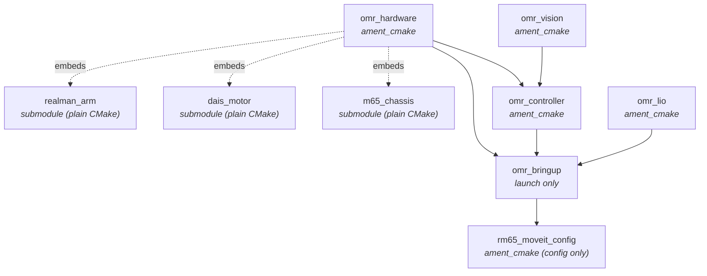
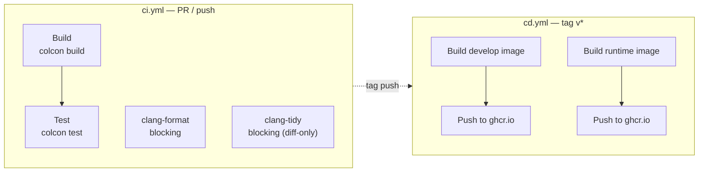
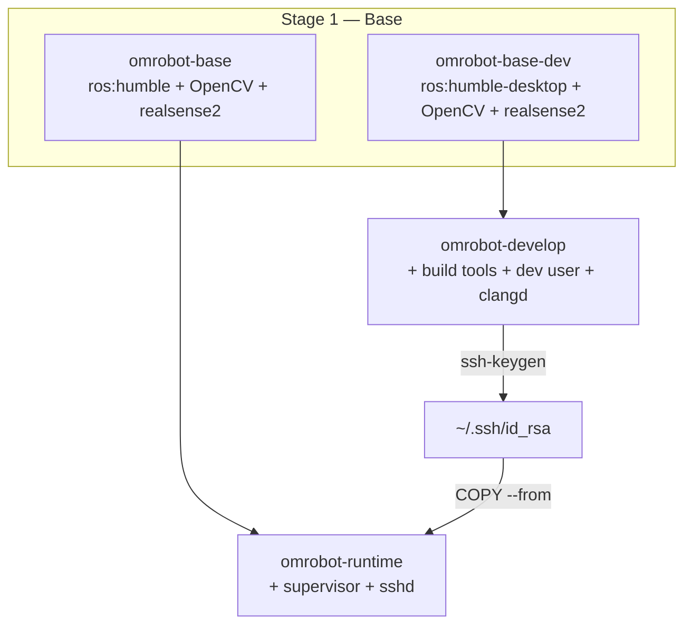

# OMRobot — Mobile Platform Robotic Arm ROS2 Workspace

ROS2 Humble workspace for OMRobot — a mobile platform robotic arm system integrating M65 omnidirectional chassis, D-AIS linear rail, RM65 6-axis arm, and LiDAR SLAM navigation.
Compatible arm models (RM65, RM75, ECO65, ECO63, RML63, RML63-III, GEN72, GEN72-II) via the official RM_API2 SDK.

## Prerequisites

- **Ubuntu 22.04** (Jammy)
- **ROS2 Humble** — [install guide](https://docs.ros.org/en/humble/Installation.html)
- **Git** + **SSH key** registered with GitHub (private submodules under `omr_hardware/third_party/` use SSH)

Check your ROS2 setup:

```bash
source /opt/ros/humble/setup.bash
ros2 --version
```

## Quick Start

```bash
# 1. Clone with submodule
git clone --recurse-submodules git@github.com:ChiefTechLabs/omrobot.git
cd omrobot

# 2. Build
source /opt/ros/humble/setup.bash
colcon build

# 3. Launch the ros2_control pipeline
source install/setup.bash
ros2 launch omr_bringup bringup.launch.py arm_ip:=192.168.1.18

# Arm examples removed; use ros2_control pipeline instead
```

## Project Structure

```
omrobot/                            # ROS2 workspace root
├── src/
│   ├── omr_vision/                   # ament_cmake — RealSense D435 capture + camera calibration
│   │   ├── include/omr_vision/
│   │   │   ├── camera/               #   CameraStream, CameraConfig
│   │   │   ├── calibration/          #   CameraCalibrator, board detection
│   │   │   └── capture.hpp           #   Capture abstraction
│   │   ├── src/
│   │   │   └── calibration/          #   camera_calib.cpp
│   │   ├── apps/                     #   calibrate_camera
│   │   ├── test/                     #   8 test files (camera calibration, synthetic data)
│   │   ├── CMakeLists.txt
│   │   └── package.xml
│   ├── omr_hardware/                 # ament_cmake — ros2_control plugins
│   │   ├── third_party/
│   │   │   ├── realman_arm/          #   Git submodule — pure C++ arm control (zero ROS deps)
│   │   │   │   └── third_party/RM_API2/  # Nested submodule — RealMan C SDK
│   │   │   ├── dais_motor/           #   Git submodule — pure C++ Modbus RTU driver (zero ROS deps)
│   │   │   └── m65_chassis/          #   Git submodule — pure C++ serial chassis driver (zero ROS deps)
│   │   ├── include/omr_hardware/
│   │   │   ├── arm_system.hpp        #   ArmSystem plugin (wraps rm::Arm)
│   │   │   ├── dais_hardware.hpp     #   DaisHardware plugin (wraps dais::Motor)
│   │   │   └── m65_hardware.hpp      #   M65BaseHardware plugin (wraps m65::Chassis)
│   │   ├── src/
│   │   │   ├── arm_system.cpp
│   │   │   ├── dais_hardware.cpp
│   │   │   └── m65_hardware.cpp
│   │   ├── plugins.xml               #   ArmSystem + DaisHardware + M65BaseHardware registration
│   │   ├── CMakeLists.txt
│   │   └── package.xml
│   ├── omr_controller/               # ament_cmake — behavior tree-based task orchestrator + hand-eye calibration
│   │   ├── include/omr_controller/
│   │   │   ├── orchestrator.hpp      #   TaskOrchestrator (rclcpp::Node + BT.CPP tick loop)
│   │   │   ├── clients/              #   Non-blocking ROS2 clients
│   │   │   │   ├── arm_client.hpp    #     ArmClient → JTC action + /joint_states
│   │   │   │   ├── gripper_client.hpp#   GripperClient → GripperCommand action
│   │   │   │   ├── motor_client.hpp  #     MotorClient (abstract) + MotorClientStub
│   │   │   │   ├── base_client.hpp   #     BaseClient (abstract) + BaseClientStub
│   │   │   │   └── vision_client.hpp #     VisionClient → CameraStream + OpenCV detect
│   │   │   ├── state_machine/
│   │   │   │   ├── bt_factory.hpp                #  BT.CPP custom nodes registration
│   │   │   │   └── door_trajectory_action.hpp    #  DoorTrajectoryAction (BT::StatefulActionNode)
│   │   │   ├── door_math.hpp          #     Door trajectory math model C(θ,φ,ω) + R_T(θ,φ,ω)
│   │   │   ├── geometry_utils.hpp     #     homogeneous_to_pose() conversion utility
│   │   │   ├── calib/                  #     Hand-eye calibration pipeline
│   │   │   │   ├── collector.hpp       #       Data collection from arm + camera
│   │   │   │   ├── hand_eye.hpp        #       AX=XB solver (Tsai, Park)
│   │   │   │   ├── pose_proc.hpp       #       Pose preprocessing
│   │   │   │   └── transform.hpp       #       TF2 + Eigen conversions
│   │   │   └── types.hpp             #     Core data types
│   │   ├── src/                      #   Implementation files
│   │   │   ├── orchestrator.cpp
│   │   │   ├── state_machine/
│   │   │   │   └── door_trajectory_action.cpp # DoorTrajectoryAction: MoveIt2 + state machine + collision
│   │   │   ├── calib/                 #   collector.cpp, hand_eye.cpp, pose_proc.cpp, transform.cpp
│   │   │   └── clients/
│   │   ├── apps/                      #   calib_node, collect, compute_hand_eye, process_poses, run_pipeline
│   │   ├── bt_xml/                   #   Behavior tree XML definitions
│   │   │   └── pick_and_place.xml
│   │   ├── launch/                   #   controller.launch.py
│   │   ├── config/                   #   controller.yaml
│   │   ├── test/                     #   22+ test files covering door math, collision, BT, clients, calib, etc.
│   │   ├── CMakeLists.txt
│   │   └── package.xml
│   ├── rm65_moveit_config/           # ament_cmake — MoveIt2 config for RM65 (no compiled code)
│   │   ├── config/                    #   SRDF, kinematics (KDL), OMPL, controller config
│   │   ├── launch/                    #   move_group.launch.py
│   │   ├── urdf/                      #   RM65 URDF with geometric collision primitives
│   │   ├── CMakeLists.txt
│   │   └── package.xml
│   ├── omr_lio/                       # ament_cmake — LiDAR-IMU SLAM + Nav2 navigation
│   │   ├── include/omr_lio/           #   LioNode, EstopperNode, S-FAST_LIO headers
│   │   ├── src/                       #   lio_node, estopper_node, preprocess
│   │   ├── third_party/               #   Sophus (Lie algebra), ikd-Tree (incremental kd-tree)
│   │   ├── config/                    #   lio.yaml, nav2_params.yaml, estopper.yaml
│   │   ├── launch/                    #   lio_mapping.launch.py, m65_lio_nav.launch.py
│   │   ├── scripts/                   #   record_waypoints.py, inspection_sequencer.py, csv_to_yaml.py
│   │   ├── CMakeLists.txt
│   │   └── package.xml
│   └── omr_bringup/                  # ament_cmake — launch + config + URDF (no compiled code)
│       ├── launch/
│       │   ├── bringup.launch.py      #   ros2_control pipeline (RSP + CM + JSB + JTC + camera + calib)
│       │   ├── calibration.launch.py
│       │   └── view_robot.launch.py   #   RViz visualization of full robot model
│       ├── config/
│       │   ├── realman_controllers.yaml  # JSB + JTC config (100Hz, open-loop)
│       │   ├── m65_controllers.yaml     # M65 chassis controller config
│       │   └── view_robot.rviz          # RViz config for full robot view
│       ├── urdf/
│       │   ├── omr.urdf.xacro          #   Combined robot model (M65 + D-AIS rail + RM65 arm)
│       │   ├── m65/
│       │   │   ├── m65.model.xacro     #   M65 chassis mechanical model
│       │   │   ├── m65.ros2_control.xacro  # M65 ros2_control config
│       │   │   └── meshes/             #   M65 STL meshes
│       │   ├── dais/
│       │   │   ├── dais.model.xacro    #   D-AIS linear rail mechanical model
│       │   │   ├── dais.ros2_control.xacro # D-AIS ros2_control config
│       │   │   └── meshes/             #   Track + connector STL meshes
│       │   └── arm/
│       │       ├── realman.urdf.xacro  #   Arm assembly (kinematics + ros2_control)
│       │       ├── realman.ros2_control.xacro  # Arm ros2_control config
│       │       ├── rm_65.urdf.xacro    #   Vendored upstream RM65 kinematics
│       │       └── meshes/rm_65_arm/   #   Arm STL meshes
│       ├── CMakeLists.txt
│       └── package.xml
├── .github/workflows/                 # CI/CD pipelines
│   ├── ci.yml                          #   Build, test, lint on PR/push
│   └── cd.yml                          #   Docker image publish on tag
├── cmake/                              # Shared CMake modules (clang_tidy.cmake, etc.)
├── scripts/                          # Deployment scripts
│   ├── deploy-remote                 #   Sync + restart services on robot
│   ├── sync-remote                   #   Rsync install/ to runtime container
│   ├── ssh-remote                    #   SSH into runtime (port 2022)
│   ├── build-local                   #   Build workspace + compile_commands
│   ├── generate-compile-commands.sh  #   Merge clangd compile_commands.json
│   ├── entrypoint-dev.sh             #   Develop container entrypoint
│   ├── entrypoint-runtime.sh         #   Runtime container entrypoint
│   └── supervisord.conf              #   Supervisor config (auto-starts controller_manager + calib_node)
├── .devcontainer/
│   └── devcontainer.json             # VS Code dev container config
├── Dockerfile                        # Multi-stage (develop + runtime)
├── docker-compose.yml
├── .env.example                      # Proxy + ROS_DOMAIN_ID config
├── .clang-format                       # Google-based, 4-space indent, 100col
├── .clang-tidy                         # C++23 target, GCC 11.4 toolchain
├── .clangd                             # clangd LSP config (ROS2 header suppression)
├── docs/                             # Project documentation
```

## Architecture

```mermaid
flowchart TD
    subgraph ROS2["ROS2 Control Loop — Arm Subsystem"]
        RSP["robot_state_publisher<br/><i>TF + /robot_description</i>"]
        CM["controller_manager<br/><i>ros2_control_node @ /controller_manager</i>"]
        JSB["joint_state_broadcaster<br/><i>→ /joint_states</i>"]
        JTC["joint_trajectory_controller<br/><i>action: .../follow_joint_trajectory</i>"]
        HW["ArmSystem<br/><i>hardware_interface plugin</i>"]
    end

    JSB -->|reads state| HW
    JTC -->|writes command| HW
    HW --> Arm

    Arm["rm::Arm<br/><i>PIMPL facade — zero ROS deps</i>"]
    Arm --> Impl["Arm::Impl<br/><i>worker thread + cmd queue</i>"]
    Impl --> SDK["libapi_c.so<br/><i>RM_API2 C SDK</i>"]
    SDK -->|TCP| HW2["RM65 Robot Arm"]

    Arm -.->|Lazy connect| Impl
    Arm -.->|setGripperRoute / RS-485| GripHw["Gripper<br/><i>CTAG2F90D / EG2-4C2</i>"]

    %% Camera
    subgraph Vision["omr_vision — Camera Capture"]
        CamStream["CameraStream<br/><i>librealsense2 pipeline</i>"]
        CamCfg["CameraConfig<br/><i>width/height/fps/depth</i>"]
    end
    CamStream -->|RGB-D frames| BB

    %% D-AIS Motor subsystem
    subgraph DaisROS2["ROS2 Control Loop — D-AIS Motor"]
        DCM["dais_controller_manager<br/><i>ros2_control_node @ /dais_controller_manager</i>"]
        DJSB["dais_joint_state_broadcaster<br/><i>→ /dais/joint_states</i>"]
        DJTC["dais_joint_trajectory_controller<br/><i>action: .../follow_joint_trajectory</i>"]
        DHW["DaisHardware<br/><i>hardware_interface plugin (velocity cmd)</i>"]
    end

    DJSB -->|reads state| DHW
    DJTC -->|writes command| DHW
    DHW --> Motor["dais::Motor<br/><i>pure C++ Modbus RTU driver</i>"]
    Motor -->|Modbus RTU| PHW["D-AIS Motor"]

    %% M65 Chassis subsystem
    subgraph M65ROS2["ROS2 Control Loop — M65 Chassis"]
        M65CM["m65_controller_manager<br/><i>ros2_control_node @ /m65_controller_manager</i>"]
        M65JSB["m65_joint_state_broadcaster<br/><i>→ /m65/joint_states</i>"]
        M65DDC["diff_drive_controller<br/><i>← cmd_vel (Twist)  → odom</i>"]
        M65HW["M65BaseHardware<br/><i>hardware_interface plugin (velocity cmd)</i>"]
    end

    M65JSB -->|reads state| M65HW
    M65DDC -->|writes command| M65HW
    M65HW --> Chassis["m65::Chassis<br/><i>pure C++ serial driver</i>"]
    Chassis -->|Serial| CHW["M65 Mobile Base"]

    %% LiDAR SLAM & Navigation
    subgraph LIO["LiDAR SLAM & Navigation (omr_lio)"]
        LIONode["LioNode<br/><i>S-FAST_LIO (ESKF + ikd-Tree)</i>"]
        ESTOP["EstopperNode<br/><i>reactive stop (0.3m)</i>"]
        NAV2["Nav2<br/><i>SmacHybrid2D planner<br/>RegulatedPurePursuit controller</i>"]
        SEQ["InspectionSequencer<br/><i>YAML waypoints → NavigateToPose</i>"]
    end

    LIDAR["Livox Mid-360"] -->|livox/lidar| LIONode
    IMU["IMU (built-in)"] -->|livox/imu| LIONode
    LIONode -->|lio/odom + TF map→odom| M65DDC
    M65DDC -->|wheel odom| LIONode
    LIONode -->|cloud_registered| ESTOP
    LIONode -->|cloud_registered| NAV2
    LIONode -->|lio/odom| NAV2
    NAV2 -->|cmd_vel| M65DDC
    ESTOP -->|lio/emergency_stop| M65DDC
    SEQ -->|navigate_to_pose| NAV2

    %% Task Orchestrator
    subgraph Orchestrator["Task Orchestrator (omr_controller)"]
        ORCH["TaskOrchestrator<br/><i>rclcpp::Node + BT.CPP tick loop (20 Hz)</i>"]
        BT["BehaviorTree.CPP v4<br/><i>BT XML → blackboard</i>"]
        BB["Blackboard<br/><i>arm_client | gripper_client<br/>vision_client | ros_node<br/>base_client [not wired] | motor_client [not wired]</i>"]
        DTA["DoorTrajectoryAction<br/><i>BT::StatefulActionNode<br/>(creates own MoveGroupInterface)</i>"]
    end

    ORCH --> BT
    BT --> BB
    BT --> DTA
    BB -->|action goal| JTC
    BB -->|subscribes| JSB
    DTA -->|setPoseTarget / plan / execute| MG
    DTA -->|add / update collision objects| SCENE
    DTA -->|subscribes| JSB

    %% Hand-Eye Calibration Pipeline
    subgraph Calib["Hand-Eye Calibration (omr_controller::calib)"]
        COLLECT["CalibDataCollector<br/><i>arm waypoints + camera capture</i>"]
        PPROC["PoseProcessor<br/><i>A_i = T(i+1) * inv(T(i))</i>"]
        HESOLVE["HandEyeSolver<br/><i>AX=XB (Tsai/Park/Horaud/Daniilidis)</i>"]
        XFORM["TransformPublisher<br/><i>TF: camera to end-effector</i>"]
    end

    Arm -->|moveJ waypoints| COLLECT
    CamStream -->|RGB frames| COLLECT
    COLLECT -->|arm poses + images| PPROC
    PPROC -->|R_tool, t_tool| HESOLVE
    HESOLVE -->|R, t = X| XFORM
    XFORM -->|TF broadcast| RSP

    %% MoveIt2 Planning
    subgraph MoveIt["MoveIt2 Planning"]
        MG["move_group<br/><i>collision-aware planning (OMPL)</i>"]
        SCENE["Planning Scene<br/><i>application-managed collision objects</i>"]
    end

    MG -->|action goal| JTC
    MG -->|subscribes| JSB
    MG -->|robot_description| RSP
```



**Arm data flow:** `ArmSystem.read()` → `rm::Arm::jointPosition()` → `/joint_states`. The
`joint_trajectory_controller` receives `FollowJointTrajectory` action goals → `ArmSystem.write()`
→ `rm::Arm::moveJ()` → TCP → arm. Gripper is controlled via `rm::Arm::setGripperRoute()`
(RS-485 through arm end-effector), not through ros2_control.

**D-AIS motor data flow:** `DaisHardware.read()` → `dais::Motor::read_state()` → `/dais/joint_states`.
The `joint_trajectory_controller` (velocity-mode, PID closed-loop) receives action goals →
`DaisHardware.write()` → `dais::Motor::set_velocity_command()` → Modbus RTU → motor.
Note: `MotorClient` in the orchestrator is a stub and not registered in the BT blackboard.

**M65 chassis data flow:** `M65BaseHardware.read()` → `m65::Chassis::read_state()` (encoder→rad)
→ `/m65/joint_states`. The `diff_drive_controller` receives `cmd_vel` (Twist) → computes
per-wheel velocities → `M65BaseHardware.write()` → `m65::Chassis::set_velocity()` → serial → base.
Note: `BaseClientImpl` is created in the orchestrator but not registered in the BT blackboard;
no BT action node can currently command the M65 chassis.

**omr_lio data flow:** `LioNode` fuses Livox Mid-360 point cloud + built-in IMU via
S-FAST_LIO (ESKF + ikd-Tree), publishing `/lio/odom` and TF `map→odom` for global
localization. The M65 `diff_drive_controller` provides wheel odometry as `odom→base_link`,
forming a continuous TF chain: `map → odom → base_footprint → base_link`. Nav2
(SmacHybrid2D planner + RegulatedPurePursuit controller) uses costmaps from `/cloud_registered`
and `/lio/odom` to plan collision-free paths. `EstopperNode` monitors `/cloud_registered`
and publishes `/lio/emergency_stop` when obstacles are detected within 0.3m.

**Inspection flow:** `InspectionSequencer` loads YAML-defined waypoints. On receiving a
waypoint name via `/inspection_sequencer/go_to_waypoint`, it sends a `NavigateToPose` action
to Nav2. Upon arrival, if the waypoint has a `task` field, it publishes
`start:<task>:<name>` on `/chassis/task_event`, waits for `/chassis/task_done` from the
external scheduler (e.g., arm controller), then publishes `done:<task>:<name>`.

**Orchestrator data flow:** `TaskOrchestrator` runs a BT.CPP v4 behavior tree at 20 Hz.
Client instances (`arm_`, `gripper_`, `vision_`, `motor_`, `base_`) are created in the
constructor. `vision_` wraps `omr_vision::camera::CameraStream` (RealSense D435 RGB-D
capture) via `CameraStreamAdapter`. Only `arm_client`, `gripper_client`, `vision_client`,
and `ros_node` are registered on the BT blackboard (via `build_tree()`). `motor_client`
and `base_client` are created but not wired into the BT. Task flows are defined in XML
under `bt_xml/`.

**MoveIt2 data flow:** `DoorTrajectoryAction` creates its own `MoveGroupInterface` and
`PlanningSceneInterface` from the blackboard's `ros_node` in `onStart()`. It subscribes to
`/joint_states` independently. MoveGroup sends `FollowJointTrajectory` action goals to the
arm's JTC and reads `/joint_states`. Planning scene collision objects are managed
application-side — `move_group` itself is task-agnostic.

**Calibration data flow:** `CalibDataCollector` runs the arm through waypoints via
`rm::Arm::moveJ()`, captures chessboard images from `CameraStream`, and saves paired
(arm pose, image) data. `PoseProcessor` computes relative arm motions
A_i = T(i+1) * inv(T(i)) from the collected poses. `HandEyeSolver` solves the AX=XB
hand-eye calibration using four methods (Tsai, Park, Horaud, Daniilidis) and picks the
one with lowest reprojection error. `TransformPublisher` broadcasts the resulting
camera→end-effector transform as a TF frame. The pipeline supports both EyeInHand and
EyeToHand modes.

`rm::Arm` is a plain C++ class (not an `rclcpp::Node`) with **zero ROS dependency**.
It lives in the `realman_arm` git submodule under `omr_hardware/third_party/`.
It can be used in any context — embedded in your own ROS2 node, linked into a
`ros2_control` hardware interface, or used standalone outside ROS2.

`dais::Motor` and `m65::Chassis` follow the same pattern — pure C++ drivers (zero ROS deps)
in their respective submodules, wrapped by `DaisHardware` and `M65BaseHardware` plugins in `omr_hardware`.

### Bringup

```bash
# Start ros2_control pipeline (arm driver + controllers)
ros2 launch omr_bringup bringup.launch.py arm_ip:=192.168.1.18

# Start with camera + calibration
ros2 launch omr_bringup bringup.launch.py

# Arm-only (no camera or calibration)
ros2 launch omr_bringup bringup.launch.py launch_camera:=false launch_calib:=false

# Start dais motor driver alongside arm
ros2 launch omr_bringup bringup.launch.py launch_dais:=true

# Configure dais motor hardware params
ros2 launch omr_bringup bringup.launch.py \
    launch_dais:=true \
    serial_port:=/dev/ttyRS485 \
    baud_rate:=57600 \
    slave_id:=1 \
    gear_ratio:=1000

# Start with M65 chassis driver
ros2 launch omr_bringup bringup.launch.py launch_m65:=true

# Configure M65 chassis hardware params
ros2 launch omr_bringup bringup.launch.py \
    launch_m65:=true \
    m65_serial_port:=/dev/ttyBase \
    m65_baud_rate:=115200
```

The bringup loads the RM65 URDF (kinematics + meshes), starts ros2_control_node with
`joint_state_broadcaster` and `joint_trajectory_controller`, then publishes TF via
`robot_state_publisher`. All arm nodes are conditioned on `launch_arm:=true`.

The bringup now supports `launch_dais:=true` to start a second `controller_manager` for the D-AIS motor at 50Hz (velocity-mode JTC with PID). Dais hw params are configurable via launch args.

Similarly, `launch_m65:=true` starts a third `controller_manager` for the M65 mobile
base with `joint_state_broadcaster` and `diff_drive_controller`. The orchestrator's
`BaseClientImpl` communicates with it via Twist `cmd_vel` + odometry.

### Visualization

The unified robot URDF (`omr.urdf.xacro`) combines all subsystems into a single model
tree for RViz visualization:

```bash
ros2 launch omr_bringup view_robot.launch.py
```

This shows the M65 chassis, D-AIS linear rail with connector plate, and RM65 6-axis arm
in their correct spatial relationships. Use the joint_state_publisher_gui sliders to
move the prismatic rail joint and arm joints.

### MoveIt2 collision-aware planning

The workspace includes a `rm65_moveit_config` package with MoveIt2 configuration
(SRDF, KDL kinematics, OMPL planners) for the RM65 arm. The URDF uses geometric
collision primitives (cylinders + boxes) instead of STL meshes for FCL compatibility.

`move_group` launches as a persistent planning service alongside the ros2_control
pipeline. Application-level BT nodes manage the planning scene and collision objects
— `move_group` itself is task-agnostic.

```bash
# Launch arm + MoveIt2
ros2 launch omr_bringup bringup.launch.py launch_moveit:=true
```

**Example: door trajectory**

`DoorTrajectoryAction` (`BT::StatefulActionNode`) demonstrates MoveIt2 usage for a
specific task. It computes target poses from a parametric `(θ, φ, ω)` math model,
registers task-specific collision objects (door panel + frame) in the planning scene,
and delegates planning and execution to `move_group`. All business logic — the math
model, collision object geometry, trajectory schedule — lives in the controller package,
not in MoveIt2 config.

```xml
<!-- Example BT XML usage -->
<DoorTrajectoryAction
  r="2.0" L="1.5" h="0.0"
  hinge_transform="0,0,0,0,0,0"
  theta_max_deg="90" theta_step_deg="5"
  phi_values="0,15,30,45,60,75,90"
  omega_values="0,10,20"
  home_joints="0,0,0,0,0,0"/>
```

### LiDAR SLAM & Navigation (omr_lio)

`omr_lio` adds autonomous navigation to the M65 mobile base via S-FAST_LIO
LiDAR-IMU odometry and Nav2 standard navigation stack:

```
Livox Mid-360 + IMU → LioNode → /lio/odom + TF map→odom
M65 diff_drive_controller → /odom + TF odom→base_link
Nav2 (SmacHybrid + RPP) → /cmd_vel → M65 chassis
```

**Key components:**
- **LioNode** — S-FAST_LIO LiDAR-inertial odometry (ESKF + ikd-Tree), publishes `/lio/odom`, `/cloud_registered`, `/laser_map`
- **EstopperNode** — Reactive emergency stop from point cloud (0.3m threshold)
- **Inspection Sequencer** — YAML-defined waypoints, NavigateToPose per point by name, task event handshake (`/chassis/task_event`/`/chassis/task_done`)
- **Waypoint recording** — CSV recording from `/lio/odom` with auto (distance) and remote (`/waypoint_task`) triggers
- **Nav2** — SmacHybrid2D planner + RegulatedPurePursuit controller, costmaps from `/cloud_registered`

Launch with M65 chassis:
```bash
ros2 launch omr_bringup bringup.launch.py launch_m65:=true launch_m65_lio:=true
```

For detailed usage instructions, see **[docs/omr_lio_usage.md](docs/omr_lio_usage.md)**.

## Building

The SDK is discovered at `/opt/realman-sdk` (or `$REALMAN_SDK`) via
`find_package(RealManSDK REQUIRED)` backed by `src/omr_hardware/third_party/realman_arm/cmake/RealManSDKConfig.cmake`.
The Docker build copies SDK files from the submodule to this location.

```bash
source /opt/ros/humble/setup.bash
colcon build
```

Override SDK path:
```bash
colcon build --cmake-args -DREALMAN_SDK=/custom/path
```

### Build order



`colcon build` resolves this automatically, but it matters when building packages individually or adding cross-package dependencies.

| Package | Build system | Purpose |
|---|---|---|
| `omr_vision` | ament_cmake | RealSense D435 capture + camera calibration (OpenCV + librealsense2, no ROS deps) |
| `omr_hardware` | ament_cmake | ros2_control plugins (ArmSystem, DaisHardware, M65BaseHardware) |
| `omr_controller` | ament_cmake | Behavior tree-based task orchestrator (BT.CPP v4) + hand-eye calibration pipeline. Note: `motor_client` and `base_client` are created but not wired into BT blackboard. |
| `rm65_moveit_config` | ament_cmake | MoveIt2 config for RM65 (SRDF, KDL, OMPL) |
| `omr_lio` | ament_cmake | S-FAST_LIO LiDAR-IMU SLAM, Nav2 navigation, waypoint tools, emergency stop |
| `omr_bringup` | ament_cmake | Launch files + config + URDF (no compiled code) |

### clangd IntelliSense

For IDE support, build with compile_commands and merge across packages:

```bash
colcon build --cmake-args -DCMAKE_EXPORT_COMPILE_COMMANDS=ON
generate-compile-commands.sh
```

This produces `build/compile_commands.json` at the workspace root, which clangd
uses for go-to-definition, diagnostics, and completions. The `.clangd` config
suppresses ROS2-header false positives and disables `UnusedIncludes`. The dev
container runs this automatically on creation.

### Task Orchestrator (omr_controller)

The `omr_controller` package provides a behavior tree-based task orchestrator built
on BehaviorTree.CPP v4. It connects to all robot subsystems through standard ROS2
interfaces:

```
TaskOrchestrator (20 Hz BT tick loop)
  ├── ArmClient       → /arm_cm/follow_joint_trajectory
  ├── GripperClient   → /gripper/follow_joint_trajectory
  ├── MotorClient     → /dais_cm/follow_joint_trajectory (stub)
  ├── BaseClientImpl  → /m65_controller_manager/diff_drive_controller/cmd_vel + /odom
  └── VisionClient    → RealSense D435 + OpenCV detection
```

```bash
# Launch the orchestrator
ros2 launch omr_controller controller.launch.py
```

The task flow (pick-and-place, inspection, etc.) is defined in BehaviorTree XML
files under `bt_xml/`, editable without recompilation.

## Testing

Tests use `ament_cmake_gtest` and are gated behind `BUILD_TESTING`:

```bash
colcon build --cmake-args -DBUILD_TESTING=ON
colcon test
```

Test binaries need the SDK library on `LD_LIBRARY_PATH` — the CMake config
handles this via `APPEND_ENV`.

`omr_controller` and `omr_vision` share a comprehensive test suite: camera calibration, pose processing, hand-eye solvers, TF integration, and synthetic data generators.

```bash
# Required in Docker: set RMW_IMPLEMENTATION for test compatibility
export RMW_IMPLEMENTATION=rmw_cyclonedds_cpp
```

> The default `rmw_fastrtps_cpp` requires shared memory not available in Docker containers. Set `RMW_IMPLEMENTATION=rmw_cyclonedds_cpp` before running tests in Docker. This is pre-configured in the Dockerfile.

## Static Analysis

The workspace uses `clang-format` and `clang-tidy` for code quality. Config files
are at the workspace root. **Always run in Docker** — local toolchain versions
differ from CI and will produce false positives/negatives.

```bash
# Format all source files (Docker, required before push)
docker run --rm -v $(pwd):/ws omrobot:develop bash -c '
  find /ws/src -name "*.cpp" -o -name "*.hpp" -o -name "*.h" | \
    xargs clang-format -i
'

# Run clang-tidy during build (opt-in, but CI runs diff-only)
colcon build --cmake-args -DCLANG_TIDY=ON
```

Style: Google-based, 4-space indent, 100col limit, `Attach` braces, `Left`
pointer alignment. See `.clang-format` and `.clang-tidy` for full config.

## CI / CD



| Workflow | Trigger | What it does |
|---|---|---|
| `ci.yml` | push / PR to `main` | Build + test + clang-format + clang-tidy (blocking, diff-only) |
| `cd.yml` | tag push (`v*`) | Build & push Docker images to `ghcr.io` |

Images are published to GitHub Container Registry:
- `ghcr.io/chieftechlabs/omrobot-develop` — dev image
- `ghcr.io/chieftechlabs/omrobot-runtime` — runtime image

## Docker & Dev Container

The project uses a multi-stage Dockerfile and VS Code dev container.



### Develop container (GUI + build tools)

```bash
# Via docker compose (recommended):
docker compose up develop

# Or manual build:
docker build . --target omrobot-develop -t omrobot:develop
docker run -it --network host --device /dev \
    -v $(pwd):/ws -v /tmp/.X11-unix:/tmp/.X11-unix -e DISPLAY \
    omrobot:develop
```

Or open in VS Code → "Reopen in Container" (uses `.devcontainer/devcontainer.json`).

### Runtime container (robot MiniPC — headless)

```bash
docker compose up runtime -d
```

The runtime container runs supervisor with auto-starting `controller_manager` +
`calib_node`, plus an SSH server on port 2022 for receiving built artifacts.

### Deploy to robot

From the develop container:

```bash
sync-remote <robot-ip>      # rsync install/ to runtime container (SSH port 2022)
deploy-remote <robot-ip>    # sync + supervisor restart
ssh-remote <robot-ip>       # SSH into runtime
```

### Proxy config

If behind a local proxy (Clash, v2ray, etc.), copy `.env.example` to `.env` and
customize. `docker compose` reads proxy variables from `.env`.

## Updating the SDK

The SDK is pinned as a git submodule at `src/omr_hardware/third_party/realman_arm/third_party/RM_API2`. To update:

```bash
cd src/omr_hardware/third_party/realman_arm/third_party/RM_API2
git fetch
git checkout <desired-tag-or-branch>
cd -
git add src/omr_hardware/third_party/realman_arm/third_party/RM_API2
git commit -m "chore: update RM_API2 submodule to <version>"
```

The C SDK `.so` is versioned at `src/omr_hardware/third_party/realman_arm/third_party/RM_API2/C/linux/linux_x86_c_vv1.1.5/libapi_c.so`.
If the versioned path changes, update the `COPY` commands in the Dockerfile.

## Supported Arm Models

RM65 · RM75 · ECO65 · ECO63 · RML63 · RML63-III · GEN72 · GEN72-II

## License

MIT — see [LICENSE](LICENSE)
