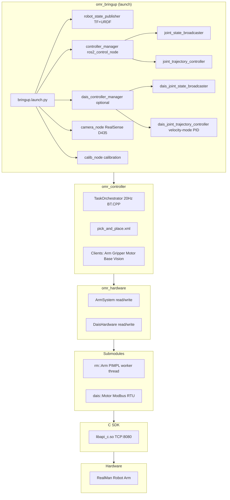
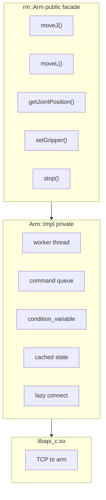
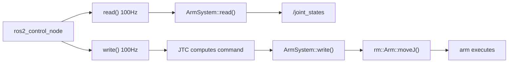
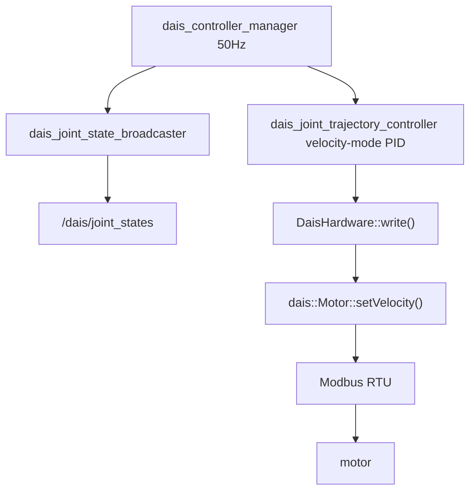
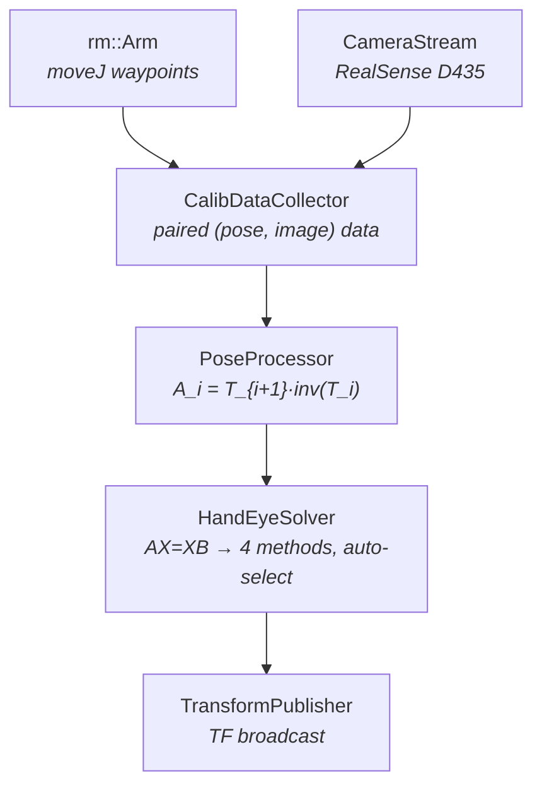
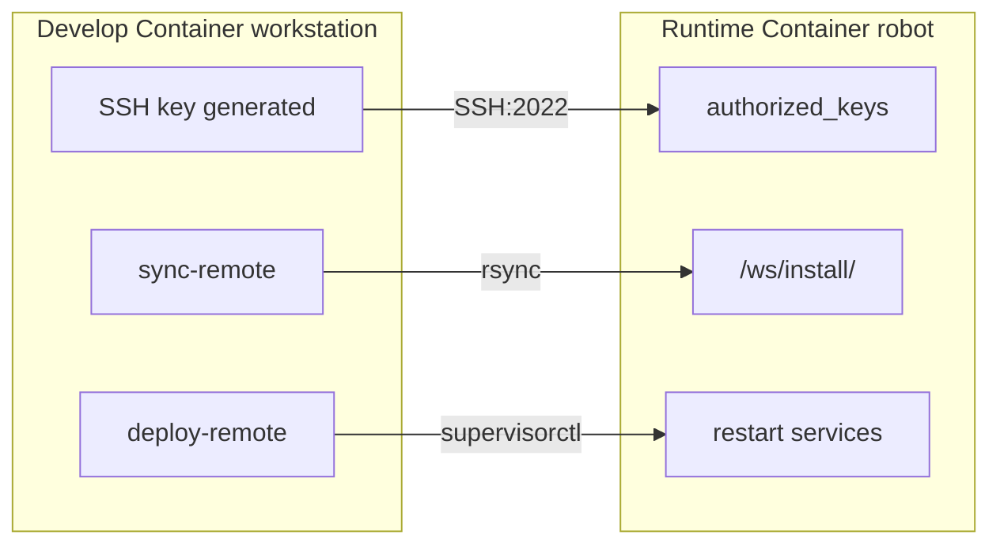

# Architecture Reference — OMRobot

Technical deep-dive for developers who need to understand how the system works
internally. Read this after [ONBOARDING.md](ONBOARDING.md) and [DEVELOPMENT.md](DEVELOPMENT.md).

## Table of Contents

1. [System Architecture](#system-architecture)
2. [Package: realman_arm (submodule)](#package-realman_arm-submodule)
3. [Package: omr_hardware](#package-omr_hardware)
4. [Package: omr_vision](#package-omr_vision)
5. [Package: omr_controller](#package-omr_controller)
6. [Package: omr_bringup](#package-omr_bringup)
7. [Cross-Cutting Concerns](#cross-cutting-concerns)

---

## System Architecture



Layers communicate through well-defined interfaces:

- Submodules expose plain C++ classes (no ROS)
- `omr_hardware` wraps them as `ros2_control` plugins (standard ROS2 interfaces)
- `omr_controller` talks to the plugins through ROS2 topics and actions
- `omr_controller` (calibration pipeline) uses `rm::Arm` directly + `omr_vision` for camera capture

---

## Package: realman_arm (submodule)

**Location:** `src/omr_hardware/third_party/realman_arm/`
**Build system:** Plain CMake (NOT ament_cmake). Zero ROS dependencies.

### Purpose

A pure C++ library wrapping the RealMan C SDK (`libapi_c.so`). Provides a clean,
type-safe, async-safe API for controlling robot arms. Usable in any C++ context —
standalone, in a ROS2 node, or embedded in a `ros2_control` hardware interface.

### Architecture: PIMPL + Worker Thread



### Source layout

```
realman_arm/
├── include/realman/
│   ├── core/          # Arm (PIMPL facade), ArmConfig, ArmState, ArmError
│   ├── motion/        # JointPosition, CartesianPose, SpeedRatio typedefs
│   ├── gripper/       # GripperState, GripperAction typedefs
│   └── hal/           # Hardware abstraction types
├── src/
│   ├── core/          # arm_facade.cpp, arm_impl.hpp, connection.cpp, error.cpp
│   ├── motion/        # motion.cpp (moveJ, moveL, moveC, moveJ_P)
│   ├── gripper/       # gripper.cpp
│   └── state/         # state.cpp (pollState, cached state)
  ├── examples/          # Removed in current version (no example executables)
  ├── cmake/             # RealManSDKConfig.cmake, FindRealManSDK.cmake
  └── test/              # test_main.cpp only — no test cases defined yet
```

### Worker thread design

Every public method on `rm::Arm` enqueues work to the single worker thread:

```cpp
// Conceptual: what happens when you call arm.moveJ({1.0, 0.5, ...}, true)
void Arm::moveJ(JointPosition target, bool blocking) {
    impl_->enqueue([target, blocking] {
        ensureConnected();
        sdk_movej(radians_to_degrees(target));  // motion.cpp
    }, blocking);
}
```

The `enqueue` function:
1. Pushes the lambda onto the queue
2. If `blocking==true`, waits on a `condition_variable` until the worker signals completion
3. If `blocking==false`, returns immediately (fire-and-forget)

This design serializes all SDK calls through one thread, eliminating data races
without per-method mutexes. The only mutex protects `ArmState` reads.

### Lazy connection

`rm_init()` is called at `Arm` construction, initializing the SDK. But the actual
TCP connection to the arm (`rm_create_robot_base()`) is deferred to the first
command via `ensureConnected()`. This means:

- You can construct an `Arm` object without an arm on the network
- Tests can create `Arm` objects without hardware
- Connection errors surface at command time, not construction time

### Unit conversion: radians ↔ degrees

**Critical invariant:** The public API uses radians. The C SDK uses degrees.
Conversion happens only inside `Arm::Impl`:

| File | Direction | Conversion |
|---|---|---|
| `motion.cpp` (moveJ, moveL, etc.) | radians → degrees | Before calling SDK |
| `state.cpp` (pollState) | degrees → radians | After reading from SDK |

When adding new joint-angle API calls, match this convention. Copy the pattern
from existing methods in `motion.cpp` and `state.cpp`.

### Known limitations

- **V1 stubs** — these methods throw `rm::ArmError("not implemented in V1")`:

- `moveJ_CANFD` / `moveP_CANFD`
- `getWorkFrames` / `setWorkFrame`
- `enableForceControl` / `disableForceControl`

- **`onMotionComplete` callback** — registered but never invoked after command completion. The callback infrastructure exists but is not wired into the worker loop.

V1 stubs need the corresponding SDK functions. The callback gap is a known implementation detail.

### Public types

```cpp
namespace rm {
    using JointPosition = std::array<double, 6>;  // radians
    using CartesianPose = std::array<double, 6>;  // {x, y, z, rx, ry, rz}
    using SpeedRatio = int;                       // 1-100 (percentage)

    enum class GripperAction { Open, Close, Stop };
    struct GripperState { int position; int speed; int current; };

    struct ArmConfig { std::string ip; int port; /* ... */ };
    struct ArmState { JointPosition joints; /* ... */ };
    class ArmError : public std::runtime_error { /* ... */ };
}
```

---

## Package: omr_hardware

**Location:** `src/omr_hardware/`
**Build system:** ament_cmake
**Dependencies:** realman_arm, dais_motor (submodules), hardware_interface, pluginlib, rclcpp

### Purpose

Provides `ros2_control` hardware interface plugins that bridge ROS2 controllers
to the arm and motor hardware. The two plugins are:

| Plugin | Hardware | Interface |
|---|---|---|
| `ArmSystem` | RealMan arm via `rm::Arm` | `hardware_interface::SystemInterface` |
| `DaisHardware` | D-AIS motor via `dais::Motor` | `hardware_interface::SystemInterface` |

### ArmSystem data flow



`ArmSystem` does **not** own the `rm::Arm` instance — it holds a reference/pointer
to one created during `on_configure()`. The arm's lifecycle (connect, disconnect)
is managed through the `hardware_interface` lifecycle state machine:

```
unconfigured → configuring → inactive → active → ...
                     ↑            ↑         ↑
                  init arm    start comm  start read/write
```

### Plugin registration

Plugins are registered in `plugins.xml`:

```xml
<class name="ArmSystem" type="omr_hardware::ArmSystem"
       base_class_type="hardware_interface::SystemInterface">
  <description>RealMan arm hardware interface</description>
</class>
```

The `package.xml` exports this via `<export><pluginlib plugin="${prefix}/plugins.xml"/></export>`.
The bringup launch file loads it through the URDF's `<ros2_control>` tag.

### D-AIS motor subsystem

A parallel control loop for auxiliary motors (linear actuators) using Modbus RTU:



The D-AIS motor runs in **velocity mode** with PID closed-loop control — unlike
the arm which runs open-loop. This means the JTC for the motor uses feedback from
the encoder to compute velocity commands, providing accurate position tracking.

---

## Package: omr_vision

**Location:** `src/omr_vision/`
**Build system:** ament_cmake
**Dependencies:** OpenCV, librealsense2. **No ROS dependencies.**

### Purpose

RealSense D435 camera capture and image processing. Provides a clean C++ API for:

- Camera configuration (resolution, FPS, streams)
- Frame capture (color + depth)
- Camera intrinsic/extrinsic parameter access

Being ROS-free means it can be used in non-ROS contexts (standalone calibration,
testing, other frameworks). Camera calibration lives in `omr_vision::calibration`;
hand-eye pipeline in `omr_controller::calib` wraps it for ROS2 use.

### Key classes

- `CameraStream` — manages the RealSense pipeline, provides frame access
- `CameraConfig` — resolution, format, stream selection

---

## Package: omr_controller

**Location:** `src/omr_controller/`
**Build system:** ament_cmake
**Dependencies:** rclcpp, behaviortree_cpp (BT.CPP v4), action_msgs, sensor_msgs, OpenCV

### Purpose

Task orchestrator using BehaviorTree.CPP v4. Defines robot tasks (pick-and-place,
inspection, assembly) as behavior tree XML files, executable without recompilation.

### Architecture

```
TaskOrchestrator (rclcpp::Node)
  │
  ├── BT.CPP tick loop (20 Hz)
  │     └── bt_xml/pick_and_place.xml (or any BT XML)
  │
  └── Client layer (non-blocking)
        ├── ArmClient        → /arm_cm/follow_joint_trajectory (action)
        ├── GripperClient    → /gripper/follow_joint_trajectory (action)
        ├── MotorClient      → /dais_cm/follow_joint_trajectory (stub)
        ├── BaseClient       → (stub — future mobile base)
        └── VisionClient     → RealSense + OpenCV object detection
```

### Client design pattern

Each client is a non-blocking wrapper around a ROS2 action client. The BT.CPP
tick loop calls the client's `executeTick()` method, which checks the current
state of the action:

- `IDLE` → send goal → return `RUNNING`
- `RUNNING` → check result → return `RUNNING` or `SUCCESS`/`FAILURE`
- `SUCCESS`/`FAILURE` → return to BT engine

This non-blocking design allows the behavior tree to continue ticking while
actions are in flight. The BT engine manages timeouts, fallbacks, and retries.

### Behavior tree XML

Tasks are defined in `bt_xml/` as XML files. Example structure:

```xml
<root>
  <BehaviorTree>
    <Sequence>
      <MoveToHome name="go_home"/>
      <DetectObject name="detect" object_class="cube"/>
      <PickObject name="pick"/>
      <MoveToPlace name="move_to_place"/>
      <PlaceObject name="place"/>
    </Sequence>
  </BehaviorTree>
</root>
```

Custom BT nodes are registered in `bt_factory.hpp`/`bt_factory.cpp`. Adding a new
node type: register it in the factory, then use it in XML.

### Hand-eye calibration pipeline

The `omr_controller::calib` namespace provides a complete hand-eye calibration
pipeline for computing the camera-to-end-effector (EyeInHand) or
camera-to-base (EyeToHand) transform.



**Components:**

| Component | Location | Purpose |
|---|---|---|
| `CalibDataCollector` | `calib/collector.{hpp,cpp}` | Moves arm through waypoints, captures chessboard images, validates rotation diversity |
| `PoseProcessor` | `calib/pose_proc.{hpp,cpp}` | Computes relative arm motions A_i from absolute poses |
| `HandEyeSolver` | `calib/hand_eye.{hpp,cpp}` | Solves AX=XB via OpenCV `calibrateHandEye` (Tsai/Park/Horaud/Daniilidis) |
| `TransformPublisher` | `calib/transform.{hpp,cpp}` | TF2 + Eigen conversions, broadcasts calibration result |

**Apps** (in `apps/`): `calib_node` (ROS2 runtime), `collect`, `compute_hand_eye`,
`process_poses`, `run_pipeline` (CLI tools).

The pipeline talks to `rm::Arm` directly (not through ros2_control) and uses
`omr_vision::camera::CameraStream` for image capture. It supports both
interactive (keypress) and auto-collection (waypoint list) modes.

### Test suite

22+ test binaries covering every client, the BT factory, XML parsing, orchestrator,
calibration pipeline, hand-eye solvers, pose processing, TF integration, and
integration tests. 100% pass rate.

---

## Package: omr_bringup

**Location:** `src/omr_bringup/`
**Build system:** ament_cmake (install only — no compiled code)
**Dependencies:** All other packages (launch dependencies)

### Purpose

Launch files, configuration, and URDF models. The entry point for starting the
robot system.

### Files

| File | Purpose |
|---|---|
| `launch/bringup.launch.py` | Main launch file: RSP + CM + JSB + JTC + camera + calib |
| `launch/calibration.launch.py` | Calibration-only launch |
| `config/realman_controllers.yaml` | JSB + JTC parameters (100 Hz, open-loop) |
| `urdf/realman.urdf.xacro` | Main URDF entry (kinematics + ros2_control) |
| `urdf/realman.ros2_control.xacro` | `<ros2_control>` wrapper for ArmSystem plugin |
| `urdf/rm_65.urdf.xacro` | Vendored upstream RM65 kinematics |
| `urdf/meshes/rm_65_arm/` | STL mesh files for visualization |

### Launch arguments

```
arm_ip:=192.168.1.18          # Arm IP address
launch_arm:=true              # Enable arm control
launch_camera:=true           # Enable RealSense camera
launch_calib:=true            # Enable calibration node
launch_dais:=false            # Enable D-AIS motor control
serial_port:=/dev/ttyRS485    # D-AIS serial port
baud_rate:=57600              # D-AIS baud rate
slave_id:=1                   # D-AIS Modbus slave ID
gear_ratio:=1000              # D-AIS gear ratio
```

---

## Cross-Cutting Concerns

### C++ version and toolchain

- **Standard:** C++23
- **Compiler:** GCC 11.4 (from Ubuntu 22.04 / ROS2 Humble)
- **Avoid:** `std::expected`, `std::ranges::to`, `std::print` (require GCC 12+)
- **Polyfills:** `expected_polyfill.hpp` and `format_polyfill.hpp` live in `omr_vision::calibration` (shared by both `omr_vision` and `omr_controller` tests)

### Code style

- **Format:** Google-based, `.clang-format` at workspace root
- **Naming:** `CamelCase` classes, `camelBack` functions, `UPPER_CASE` constants, `lower_case` namespaces
- **Includes:** Project → system → stdlib → ROS2 → other (see `.clang-format`)
- **Braces:** `Attach` style (`if (x) {` not `if (x)\n{`)
- **Indent:** 4 spaces (not Google's default 2)
- **Line limit:** 100 columns

### SDK discovery

The SDK is expected at `/opt/realman-sdk/` with `include/` and `lib/libapi_c.so`.
Discovery via `find_package(RealManSDK REQUIRED)` backed by `RealManSDKConfig.cmake`
in the `realman_arm` submodule. Override with `-DREALMAN_SDK=/custom/path`.

The Dockerfile copies SDK files from the submodule to `/opt/realman-sdk/` during
build. The `.so` path includes a version (`vv1.1.5`) — check this when updating the SDK.

### RMW implementation

The project uses `rmw_cyclonedds_cpp` instead of the default `rmw_fastrtps_cpp`.
Reason: `rmw_fastrtps_cpp` requires shared memory (`/dev/shm`), which is not
available in Docker containers with default configuration. Eclipse Cyclone DDS
works over UDP and does not require shared memory.

### Build caching (CMake)

The `realman_arm` submodule uses `GLOB_RECURSE` with `CONFIGURE_DEPENDS` across source subdirs:

```cmake
file(GLOB_RECURSE ARM_SOURCES CONFIGURE_DEPENDS
    src/core/*.cpp src/motion/*.cpp src/gripper/*.cpp src/state/*.cpp)
```

This means adding a `.cpp` to any of those directories auto-triggers CMake
reconfiguration. No need to manually update the file list.

### Container-to-container communication



The SSH key pair is generated in the develop stage, and the public key is
`COPY --from`'d into the runtime stage as an authorized key. Root login on
port 2022, key-only, no password.

### Runtime supervision

The runtime container uses supervisord with two managed programs:

```ini
[program:controller_manager]
command=source /opt/ros/humble/setup.bash && source /ws/install/setup.bash
        && ros2 run controller_manager ros2_control_node

[program:calib_node]
command=source /opt/ros/humble/setup.bash && source /ws/install/setup.bash
        && ros2 run omr_controller calib_node
```

Both auto-start and auto-restart. Logs go to stdout/stderr, visible via
`supervisorctl tail`.
