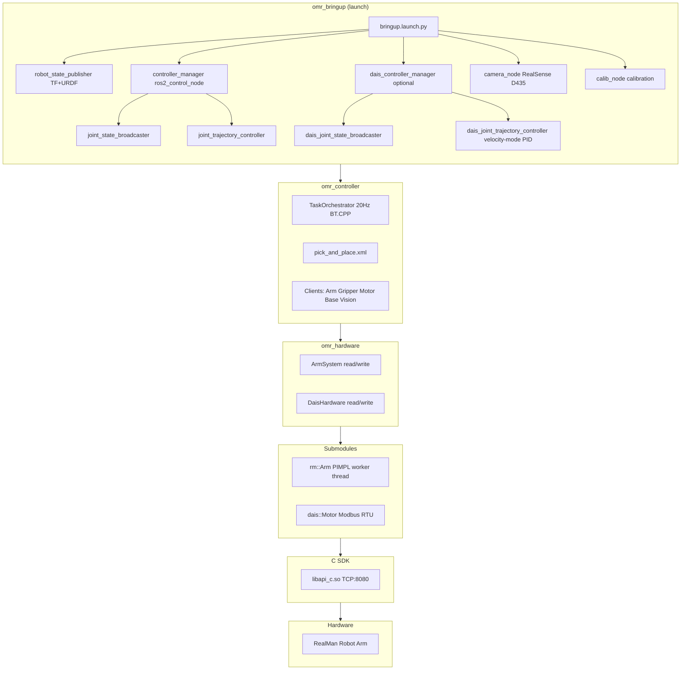
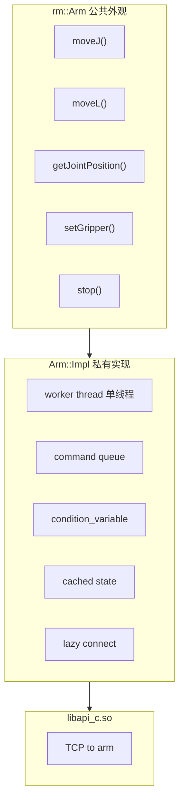
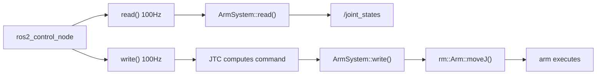
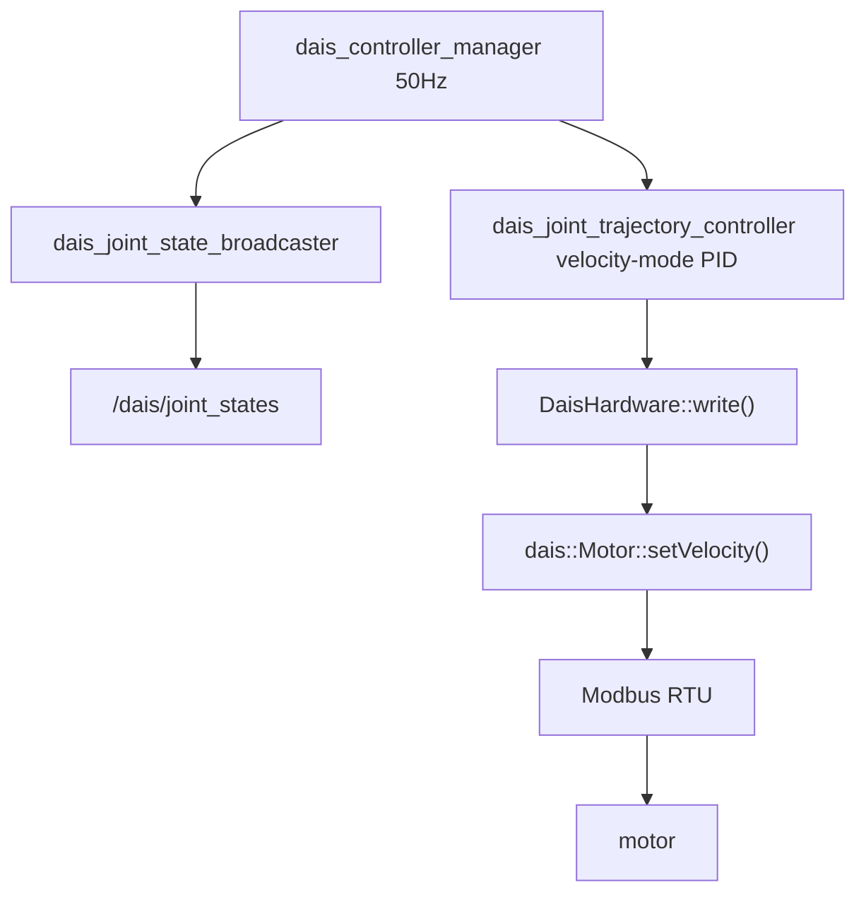
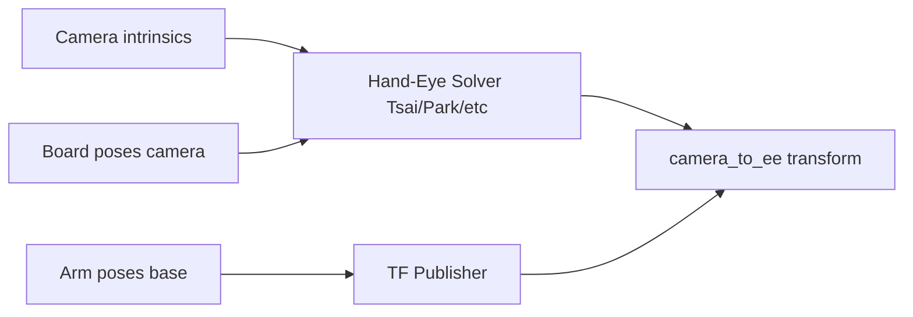
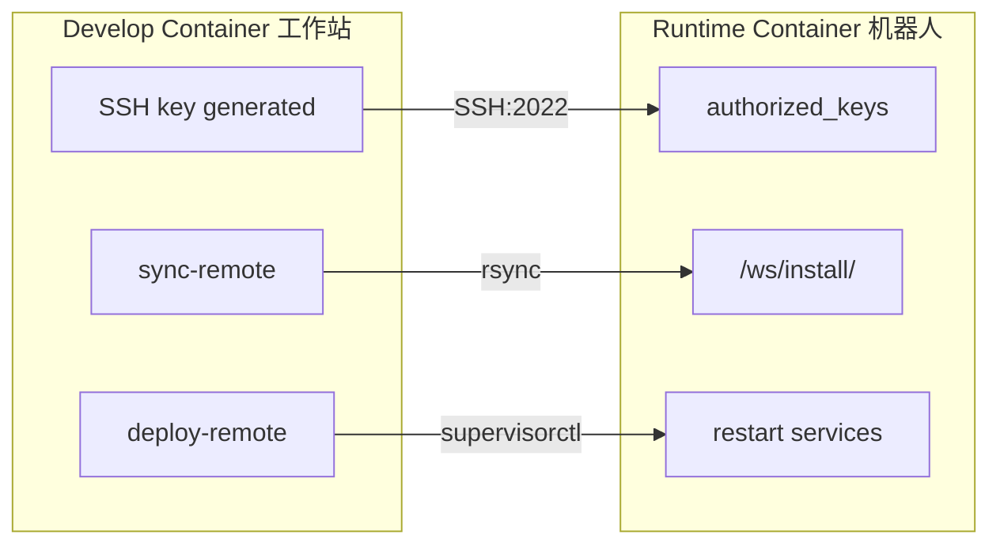

# 架构参考 — OMRobot

面向需要理解系统内部工作原理的开发者的技术深入文档。请在阅读 [ONBOARDING.md](ONBOARDING.md) 和 [DEVELOPMENT.md](DEVELOPMENT.md) 之后阅读本文。

## 目录

1. [系统架构](#系统架构)
2. [包：realman_arm（子模块）](#包realman_arm子模块)
3. [包：omr_hardware](#包omr_hardware)
4. [包：omr_vision](#包omr_vision)
5. [包：realman_calibration](#包realman_calibration)
6. [包：omr_controller](#包omr_controller)
7. [包：omr_bringup](#包omr_bringup)
8. [跨层关注点](#跨层关注点)

---

## 系统架构



各层通过良好定义的接口进行通信：

- 子模块暴露纯 C++ 类（不依赖 ROS）
- `omr_hardware` 将它们封装为 `ros2_control` 插件（标准 ROS2 接口）
- `omr_controller` 通过 ROS2 主题（topic）和动作（action）与插件通信
- `realman_calibration` 直接使用 `rm::Arm` + `omr_vision` 进行相机采集

---

## 包：realman_arm（子模块）

**位置：** `src/omr_hardware/third_party/realman_arm/`
**构建系统：** 纯 CMake（非 ament_cmake）。零 ROS 依赖。

### 用途

一个封装 RealMan C SDK（`libapi_c.so`）的纯 C++ 库。提供清晰、类型安全、异步安全的机械臂控制 API。可在任何 C++ 上下文中使用——独立程序、ROS2 节点中，或嵌入 `ros2_control` 硬件接口中。

### 架构：PIMPL + 工作线程



### 源码布局

```
realman_arm/
├── include/realman/
│   ├── core/          # Arm (PIMPL facade), ArmConfig, ArmState, ArmError
│   ├── motion/        # JointPosition, CartesianPose, SpeedRatio typedefs
│   ├── gripper/       # GripperState, GripperAction typedefs
│   └── hal/           # Hardware abstraction types
├── src/
│   ├── core/          # arm_facade.cpp, arm_impl.hpp, connection.cpp, error.cpp
│   ├── motion/        # motion.cpp (moveJ, moveL, moveC, moveJ_P)
│   ├── gripper/       # gripper.cpp
│   └── state/         # state.cpp (pollState, cached state)
  ├── examples/          # Removed in current version (no example executables)
  ├── cmake/             # RealManSDKConfig.cmake, FindRealManSDK.cmake
  └── test/              # test_main.cpp only — no test cases defined yet
```

### 工作线程设计

`rm::Arm` 上的每个公开方法都将工作入队到单个工作线程：

```cpp
// Conceptual: what happens when you call arm.moveJ({1.0, 0.5, ...}, true)
void Arm::moveJ(JointPosition target, bool blocking) {
    impl_->enqueue([target, blocking] {
        ensureConnected();
        sdk_movej(radians_to_degrees(target));  // motion.cpp
    }, blocking);
}
```

`enqueue` 函数的执行逻辑：
1. 将 lambda 压入队列
2. 若 `blocking==true`，则在 `condition_variable` 上等待，直到工作线程发出完成信号
3. 若 `blocking==false`，则立即返回（即发即忘）

这种设计将所有 SDK 调用通过一个线程序列化执行，消除了数据竞争，无需为每个方法加互斥锁。唯一的互斥锁用于保护 `ArmState` 的读取。

### 延迟连接（Lazy Connection）

`rm_init()` 在 `Arm` 构造时被调用，用于初始化 SDK。但实际的 TCP 连接到机械臂（`rm_create_robot_base()`）通过 `ensureConnected()` 推迟到首次命令执行时才建立。这意味着：

- 无需机械臂连接网络即可构造 `Arm` 对象
- 测试可在无硬件的情况下创建 `Arm` 对象
- 连接错误在命令执行时暴露，而非构造时暴露

### 单位转换：弧度 ↔ 度

**关键不变量：** 公开 API 使用弧度（radian）。C SDK 使用度（degree）。转换仅在 `Arm::Impl` 内部进行：

| 文件 | 方向 | 转换 |
|---|---|---|
| `motion.cpp`（moveJ、moveL 等） | 弧度 → 度 | 调用 SDK 之前 |
| `state.cpp`（pollState） | 度 → 弧度 | 从 SDK 读取之后 |

新增关节角度 API 调用时，请遵循此约定。参考 `motion.cpp` 和 `state.cpp` 中现有方法的模式。

### 已知限制

- **V1 桩（stub）**——以下方法会抛出 `rm::ArmError("not implemented in V1")`：

- `moveJ_CANFD` / `moveP_CANFD`
- `getWorkFrames` / `setWorkFrame`
- `enableForceControl` / `disableForceControl`

- **`onMotionComplete` 回调**——已注册，但在命令完成后从未被调用。回调基础设施已存在，但未接入工作循环。

V1 桩需要相应的 SDK 函数实现。回调缺口是已知的实现细节。

### 公开类型

```cpp
namespace rm {
    using JointPosition = std::array<double, 6>;  // radians
    using CartesianPose = std::array<double, 6>;  // {x, y, z, rx, ry, rz}
    using SpeedRatio = int;                       // 1-100 (percentage)

    enum class GripperAction { Open, Close, Stop };
    struct GripperState { int position; int speed; int current; };

    struct ArmConfig { std::string ip; int port; /* ... */ };
    struct ArmState { JointPosition joints; /* ... */ };
    class ArmError : public std::runtime_error { /* ... */ };
}
```

---

## 包：omr_hardware

**位置：** `src/omr_hardware/`
**构建系统：** ament_cmake
**依赖：** realman_arm、dais_motor（子模块）、hardware_interface、pluginlib、rclcpp

### 用途

提供 `ros2_control` 硬件接口插件，桥接 ROS2 控制器与机械臂及电机硬件。包含两个插件：

| 插件 | 硬件 | 接口 |
|---|---|---|
| `ArmSystem` | RealMan 机械臂（通过 `rm::Arm`） | `hardware_interface::SystemInterface` |
| `DaisHardware` | D-AIS 电机（通过 `dais::Motor`） | `hardware_interface::SystemInterface` |

### ArmSystem 数据流



`ArmSystem` **不**持有 `rm::Arm` 实例——它持有一个引用/指针，指向在 `on_configure()` 期间创建的实例。机械臂的生命周期（连接、断开）通过 `hardware_interface` 生命周期状态机管理：

```
unconfigured → configuring → inactive → active → ...
                   ↑            ↑         ↑
               init arm    start comm  start read/write
```

### 插件注册

插件在 `plugins.xml` 中注册：

```xml
<class name="ArmSystem" type="omr_hardware::ArmSystem"
       base_class_type="hardware_interface::SystemInterface">
  <description>RealMan arm hardware interface</description>
</class>
```

`package.xml` 通过 `<export><pluginlib plugin="${prefix}/plugins.xml"/></export>` 导出此配置。bringup 启动文件通过 URDF 的 `<ros2_control>` 标签加载插件。

### D-AIS 电机子系统

通过 Modbus RTU 协议控制辅助电机（线性执行器）的并行控制回路：



D-AIS 电机运行在**速度模式**下，采用 PID 闭环控制——与机械臂的开环控制不同。这意味着电机的 JTC（关节轨迹控制器）使用编码器反馈来计算速度指令，从而实现精确的位置跟踪。

---

## 包：omr_vision

**位置：** `src/omr_vision/`
**构建系统：** ament_cmake
**依赖：** OpenCV、librealsense2。**无 ROS 依赖。**

### 用途

RealSense D435 相机采集与图像处理。为以下功能提供简洁的 C++ API：

- 相机配置（分辨率、帧率、数据流）
- 帧采集（彩色 + 深度）
- 相机内参/外参访问

不依赖 ROS 意味着它可以在非 ROS 上下文中使用（独立标定、测试、其他框架）。标定包将其封装后供 ROS2 使用。

### 核心类

- `CameraStream`——管理 RealSense 管线，提供帧访问
- `CameraConfig`——分辨率、格式、数据流选择

---

## 包：realman_calibration

**位置：** `src/realman_calibration/`
**构建系统：** ament_cmake
**依赖：** omr_vision、realman_arm、OpenCV、rclcpp、tf2_ros、sensor_msgs

### 用途

手眼标定管线：确定相机坐标系与机械臂末端执行器（end-effector）坐标系之间的变换关系。提供：

1. **相机标定**——内参（从棋盘格图像计算）
2. **位姿处理**——在图像中检测棋盘格，计算棋盘格到相机的变换
3. **手眼求解**——从配对的位姿计算相机到末端执行器的变换
4. **TF 集成**——将标定结果发布为 ROS2 TF 坐标系
5. **calib_node**——编排完整管线的 ROS2 节点

### 标定管线



### 核心类

| 类 | 用途 |
|---|---|
| `camera_calib` | 从棋盘格图像进行内参标定 |
| `CalibDataCollector` | 采集同步的机械臂位姿和相机图像 |
| `pose_proc` | 检测棋盘格，计算棋盘格到相机的变换 |
| `hand_eye` | 求解 AX=XB，得到相机到末端执行器的变换 |
| `transform` | TF 发布和变换工具 |
| `CalibNode` | ROS2 节点：编排管线，暴露服务 |

### 测试套件

工作区中最全面的测试套件（15 个测试二进制文件）：相机标定、位姿处理、手眼求解器（Tsai、Park）、TF 集成、端到端管线、合成数据生成器。

### Polyfills

为兼容 GCC 11.4 的 C++23 polyfill：
- `expected_polyfill.hpp`——`std::expected` 等价实现
- `format_polyfill.hpp`——`std::format` 等价实现

---

## 包：omr_controller

**位置：** `src/omr_controller/`
**构建系统：** ament_cmake
**依赖：** rclcpp、behaviortree_cpp（BT.CPP v4）、action_msgs、sensor_msgs、OpenCV

### 用途

使用 BehaviorTree.CPP v4 构建的任务编排器。将机器人任务（抓取与放置、检测、装配）定义为行为树 XML 文件，无需重新编译即可执行。

### 架构

```
TaskOrchestrator (rclcpp::Node)
  │
  ├── BT.CPP tick loop (20 Hz)
  │     └── bt_xml/pick_and_place.xml (or any BT XML)
  │
  └── Client layer (non-blocking)
        ├── ArmClient        → /arm_cm/follow_joint_trajectory (action)
        ├── GripperClient    → /gripper/follow_joint_trajectory (action)
        ├── MotorClient      → /dais_cm/follow_joint_trajectory (stub)
        ├── BaseClient       → (stub — future mobile base)
        └── VisionClient     → RealSense + OpenCV object detection
```

### 客户端设计模式

每个客户端都是 ROS2 action 客户端的非阻塞封装。BT.CPP 的 tick 循环调用客户端的 `executeTick()` 方法，该方法检查 action 的当前状态：

- `IDLE` → 发送目标 → 返回 `RUNNING`
- `RUNNING` → 检查结果 → 返回 `RUNNING` 或 `SUCCESS`/`FAILURE`
- `SUCCESS`/`FAILURE` → 返回给行为树引擎

这种非阻塞设计允许行为树在 action 执行期间继续 tick。行为树引擎负责管理超时、回退（fallback）和重试。

### 行为树 XML

任务在 `bt_xml/` 目录中以 XML 文件定义。示例结构：

```xml
<root>
  <BehaviorTree>
    <Sequence>
      <MoveToHome name="go_home"/>
      <DetectObject name="detect" object_class="cube"/>
      <PickObject name="pick"/>
      <MoveToPlace name="move_to_place"/>
      <PlaceObject name="place"/>
    </Sequence>
  </BehaviorTree>
</root>
```

自定义 BT 节点在 `bt_factory.hpp`/`bt_factory.cpp` 中注册。添加新节点类型的步骤：在工厂中注册，然后在 XML 中使用。

### 测试套件

14 个测试二进制文件，覆盖每个客户端、BT 工厂、XML 解析、编排器和集成测试。100% 通过率。

---

## 包：omr_bringup

**位置：** `src/omr_bringup/`
**构建系统：** ament_cmake（仅安装——无编译代码）
**依赖：** 所有其他包（启动依赖）

### 用途

启动文件、配置和 URDF 模型。启动机器人系统的入口点。

### 文件

| 文件 | 用途 |
|---|---|
| `launch/bringup.launch.py` | 主启动文件：RSP + CM + JSB + JTC + camera + calib |
| `launch/calibration.launch.py` | 仅标定的启动文件 |
| `config/realman_controllers.yaml` | JSB + JTC 参数（100 Hz，开环） |
| `urdf/realman.urdf.xacro` | 主 URDF 入口（运动学 + ros2_control） |
| `urdf/realman.ros2_control.xacro` | ArmSystem 插件的 `<ros2_control>` 封装 |
| `urdf/rm_65.urdf.xacro` | 上游提供的 RM65 运动学文件 |
| `urdf/meshes/rm_65_arm/` | 用于可视化的 STL 网格文件 |

### 启动参数

```
arm_ip:=192.168.1.18          # 机械臂 IP 地址
launch_arm:=true              # 启用机械臂控制
launch_camera:=true           # 启用 RealSense 相机
launch_calib:=true            # 启用标定节点
launch_dais:=false            # 启用 D-AIS 电机控制
serial_port:=/dev/ttyRS485    # D-AIS 串口
baud_rate:=57600              # D-AIS 波特率
slave_id:=1                   # D-AIS Modbus 从站 ID
gear_ratio:=1000              # D-AIS 减速比
```

---

## 跨层关注点

### C++ 版本与工具链

- **标准：** C++23
- **编译器：** GCC 11.4（来自 Ubuntu 22.04 / ROS2 Humble）
- **避免使用：** `std::expected`、`std::ranges::to`、`std::print`（需要 GCC 12+）
- **Polyfills：** `realman_calibration` 提供了 `expected_polyfill.hpp` 和 `format_polyfill.hpp`

### 代码风格

- **格式化：** 基于 Google 风格，工作区根目录有 `.clang-format`
- **命名：** 类用 `CamelCase`，函数用 `camelBack`，常量用 `UPPER_CASE`，命名空间用 `lower_case`
- **头文件包含顺序：** 项目 → 系统 → 标准库 → ROS2 → 其他（参见 `.clang-format`）
- **大括号：** `Attach` 风格（`if (x) {` 而非 `if (x)\n{`）
- **缩进：** 4 空格（非 Google 默认的 2 空格）
- **行宽限制：** 100 列

### SDK 发现

SDK 期望位于 `/opt/realman-sdk/`，包含 `include/` 和 `lib/libapi_c.so`。通过 `find_package(RealManSDK REQUIRED)` 发现，由 `realman_arm` 子模块中的 `RealManSDKConfig.cmake` 提供支持。可通过 `-DREALMAN_SDK=/custom/path` 覆盖路径。

Dockerfile 在构建期间从子模块复制 SDK 文件到 `/opt/realman-sdk/`。`.so` 路径包含版本号（`vv1.1.5`）——更新 SDK 时请检查此路径。

### RMW 实现

项目使用 `rmw_cyclonedds_cpp` 而非默认的 `rmw_fastrtps_cpp`。原因：`rmw_fastrtps_cpp` 需要共享内存（`/dev/shm`），而在默认配置的 Docker 容器中不可用。Eclipse Cyclone DDS 基于 UDP 工作，无需共享内存。

### 构建缓存（CMake）

`realman_arm` 在各个源码子目录中使用 `GLOB_RECURSE` 配合 `CONFIGURE_DEPENDS`：

```cmake
file(GLOB_RECURSE ARM_SOURCES CONFIGURE_DEPENDS
    src/core/*.cpp src/motion/*.cpp src/gripper/*.cpp src/state/*.cpp)
```

这意味着向这些目录中的任何一个添加 `.cpp` 文件都会自动触发 CMake 重新配置，无需手动更新文件列表。

### 容器间通信



SSH 密钥对在开发阶段生成，公钥通过 `COPY --from` 复制到运行时阶段作为授权密钥。通过 2022 端口以 root 身份登录，仅支持密钥认证，无密码。

### 运行时进程管理

运行时容器使用 supervisord 管理两个程序：

```ini
[program:controller_manager]
command=source /opt/ros/humble/setup.bash && source /ws/install/setup.bash
        && ros2 run controller_manager ros2_control_node

[program:calib_node]
command=source /opt/ros/humble/setup.bash && source /ws/install/setup.bash
        && ros2 run realman_calibration calib_node
```

两个程序均自动启动和自动重启。日志输出到 stdout/stderr，可通过 `supervisorctl tail` 查看。
