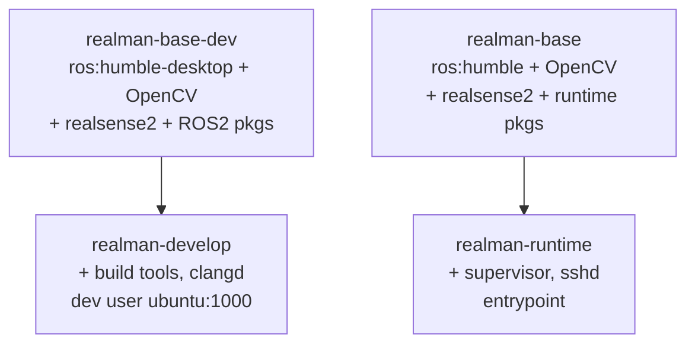
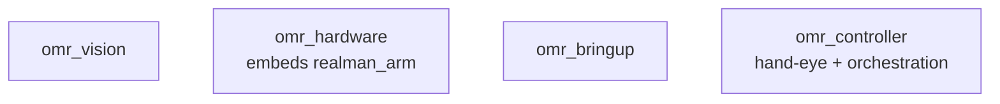
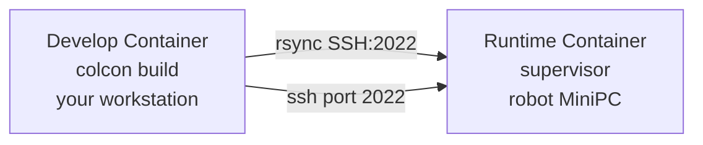
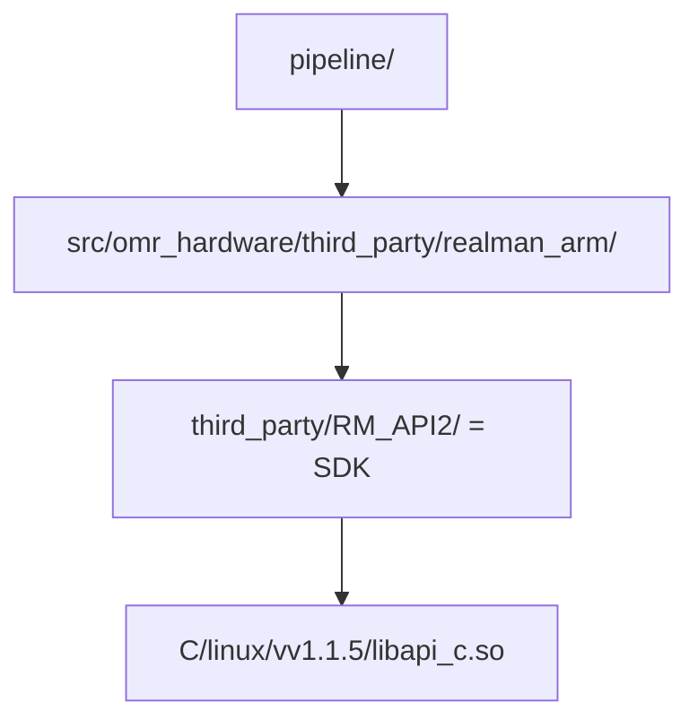

# Development Workflow — OMRobot

Day-to-day reference for building, testing, debugging, and deploying. Read this
after [ONBOARDING.md](ONBOARDING.md).

## Table of Contents

1. [Docker Deep Dive](#docker-deep-dive)
2. [Building](#building)
3. [Testing](#testing)
4. [Code Quality](#code-quality)
5. [Debugging](#debugging)
6. [Deploying to the Robot](#deploying-to-the-robot)
7. [CI/CD Pipeline](#cicd-pipeline)
8. [Adding Dependencies](#adding-dependencies)
9. [Updating the SDK](#updating-the-sdk)
10. [Common Tasks](#common-tasks)

---

## Docker Deep Dive

### Image stages

The `Dockerfile` has four stages in a dependency chain:



Key differences between `base-dev` and `base`:

| | base-dev (develop) | base (runtime) |
|---|---|---|
| Base image | `osrf/ros:humble-desktop` (GUI) | `ros:humble` (headless) |
| ROS2 packages | Full: rclcpp, tf2, geometry_msgs, hardware_interface, controller_manager, xacro, visualization_msgs, etc. | Minimal: rmw_cyclonedds, ament_cmake_test, ament_index_cpp, behaviortree_cpp, control_msgs |
| Size | ~3 GB | ~1.5 GB |
| rosdep | Not used (explicit apt) | Used with `--skip-keys realman_arm omr_hardware` |

**Why the split?** The develop image needs GUI tools (RViz) and all ROS2 headers for
building. The runtime image only needs `.so` files and the supervisor. Keeping them
separate keeps the robot deployment small.

### Container lifecycle

```bash
# Build images (first time or after Dockerfile changes)
docker compose build develop
docker compose build runtime

# Start develop shell (foreground, interactive)
docker compose up develop

# Start runtime container (background, auto-restart)
docker compose up runtime -d

# Stop
docker compose stop runtime

# Rebuild and restart runtime
docker compose up runtime -d --build
```

### Volume mounts

| Host path | Container path | Purpose |
|---|---|---|
| `.` (workspace root) | `/ws` | Source code + build artifacts (develop) |
| `/dev` | `/dev` | Hardware access (cameras, serial, arm) |
| `/tmp/.X11-unix` | `/tmp/.X11-unix` | X11 forwarding for RViz (develop only) |

In the runtime container, only `/dev` is mounted — built artifacts are synced via
rsync into `/ws/install/`.

### Proxy handling

`docker compose` reads `HTTP_PROXY` and `HTTPS_PROXY` from `.env` and passes them
as build args and environment variables. If you add a new tool that needs the
internet during build (apt, pip, curl), make sure it respects these variables.

---

## Building

### Build commands

```bash
# Standard build (inside develop container, from /ws)
colcon build

# Symlink install — faster rebuilds, good for development
colcon build --symlink-install

# Clean rebuild
rm -rf build/ install/ log/
colcon build

# Build specific package + dependents
colcon build --packages-up-to omr_controller

# Build specific package only (no dependents)
colcon build --packages-select omr_vision

# Build with tests
colcon build --cmake-args -DBUILD_TESTING=ON

# Build with clang-tidy (slow, opt-in)
colcon build --cmake-args -DCMAKE_EXPORT_COMPILE_COMMANDS=ON -DCLANG_TIDY=ON

# Override SDK path (if SDK is not at /opt/realman-sdk)
colcon build --cmake-args -DREALMAN_SDK=/custom/path
```

### Build order

`colcon build` resolves dependencies automatically, but it helps to know the chain:



`omr_bringup` has no compiled code, but `colcon build` still processes its
`CMakeLists.txt` to install launch/config/URDF files.

### clangd IntelliSense

After building, regenerate `compile_commands.json` for clangd:

```bash
build-local              # colcon build + generate-compile-commands.sh
# or manually:
generate-compile-commands.sh
```

This merges per-package `compile_commands.json` into `build/compile_commands.json`
at the workspace root. clangd reads this file for go-to-definition, diagnostics,
and completions.

The `.clangd` config:
- Suppresses ROS2 system-header warnings (false positives)
- Disables `UnusedIncludes` (ROS2 headers trigger too many)
- Uses `--background-index` for fast symbol lookup

If clangd shows errors for system headers (`rclcpp/...`, `hardware_interface/...`),
these are normal — ROS2 headers use complex macros that clangd struggles with.
Real compilation errors will show up in `colcon build`.

---

## Testing

### Running tests

```bash
# Build with tests
colcon build --cmake-args -DBUILD_TESTING=ON

# Run all tests
colcon test

# Run specific package
colcon test --packages-select omr_controller

# Show test output (even for passing tests)
colcon test-result --all --verbose

# Run tests and fail on first failure
colcon test --return-code-on-test-failure
```

### Test structure

| Package | Test binaries | Coverage |
|---|---|---|
| `omr_controller` | ~20 | arm_client, gripper_client, vision_client, motor_client, base_client, bt_factory, bt_xml, orchestrator, types, client_integration, orchestrator_integration, hand-eye solvers, TF integration, e2e pipeline, synthetic data |
| `omr_vision` | TBD | Camera calibration tests (formerly in realman_calibration) |
| `omr_hardware` | 0 | No tests yet |
| `omr_bringup` | 0 | Launch/config only |

### Writing tests

Tests use `ament_cmake_gtest`. Add `BUILD_TESTING` gate in CMakeLists.txt:

```cmake
if(BUILD_TESTING)
  find_package(ament_cmake_gtest REQUIRED)
  ament_add_gtest(my_test test/my_test.cpp)
  target_link_libraries(my_test ${PROJECT_NAME})
endif()
```

Test files go in `test/` within each package. See `src/omr_vision/test/` and
`src/omr_controller/test/` for examples of synthetic data generators and
integration tests.

### Docker test environment

Tests need `RMW_IMPLEMENTATION=rmw_cyclonedds_cpp` in Docker (the default
`rmw_fastrtps_cpp` requires shared memory). This is set in the Dockerfile.

---

## Code Quality

### Formatting

Style: Google-based, 4-space indent, 100-column limit.

```bash
# Check formatting (dry-run)
find src \( -name "*.cpp" -o -name "*.hpp" -o -name "*.h" \) \
    ! -path "*/third_party/*" | xargs clang-format --dry-run -Werror

# Apply formatting
find src \( -name "*.cpp" -o -name "*.hpp" -o -name "*.h" \) \
    ! -path "*/third_party/*" | xargs clang-format -i
```

CI enforces formatting — `clang-format --dry-run --Werror` is blocking.
VS Code auto-formats on save if `"editor.formatOnSave": true` is set (it is
in the devcontainer config).

### Static analysis

```bash
# clang-tidy during build (opt-in, generates warnings)
colcon build --cmake-args -DCLANG_TIDY=ON
```

clang-tidy is non-blocking in CI (informational only). It targets C++23 with
GCC 11.4 toolchain. See `.clang-tidy` for enabled checks.

### Naming conventions

| Kind | Convention | Example |
|---|---|---|
| Classes / Structs | `CamelCase` | `ArmSystem`, `CalibDataConfig` |
| Functions / Methods | `camelBack` | `moveJ()`, `pollState()` |
| Constants / Enums | `UPPER_CASE` | `MAX_JOINTS`, `HandEyeMode::TSAI` |
| Namespaces | `lower_case` | `rm`, `rm::calib` |
| Private members | `trailing_` | `impl_`, `connected_` |

---

## Debugging

### Build failures

1. Check the error message carefully — CMake errors are verbose but precise
2. Missing `ros-humble-*` package? → Add to Dockerfile `apt-get install`
3. Missing include? → Check `find_package()` in CMakeLists.txt and `<depend>` in package.xml
4. Linker errors? → Check `target_link_libraries()` in CMakeLists.txt

### Runtime debugging

```bash
# Check what nodes are running
ros2 node list

# Check topics
ros2 topic list
ros2 topic echo /joint_states

# Check TF frames
ros2 run tf2_tools view_frames

# Check controller manager state
ros2 control list_hardware_interfaces
ros2 control list_controllers
```

### GDB

The develop image includes GDB. To debug a specific executable:

```bash
gdb --args ros2 run omr_controller calib_node
# or for tests:
gdb --args ./build/omr_controller/test_some_test
```

### Supervisor logs (runtime)

On the robot, check supervisor-managed process logs:

```bash
ssh-remote <robot-ip>
supervisorctl status                # check all processes
supervisorctl tail controller_manager  # view logs
supervisorctl restart controller_manager  # restart if stuck
```

---

## Deploying to the Robot

### Architecture



### Deploy commands

```bash
# Step 1: Sync built artifacts
sync-remote 192.168.1.100

# Step 2 (optional): Sync + restart services
deploy-remote 192.168.1.100

# Step 3: SSH in for debugging
ssh-remote 192.168.1.100
```

What happens:
1. `sync-remote` rsyncs `/ws/install/` → `root@<ip>:/ws/install/` via SSH port 2022
2. `deploy-remote` does the same + runs `supervisorctl restart` on controller_manager and calib_node
3. Supervisor sources `/opt/ros/humble/setup.bash` and `/ws/install/setup.bash` before launching

### First-time robot setup

The runtime container needs to be running and reachable on port 2022:

```bash
# On the robot MiniPC:
docker compose up runtime -d
```

The SSH key pair is generated at build time — the develop container's public key
is baked into the runtime image's `authorized_keys`. No manual key setup needed.

---

## CI/CD Pipeline

### ci.yml — Pull Request / Push to main

Triggers on: push to `main`, PR to `main`

| Job | What it does | Blocking? |
|---|---|---|
| Build & Test | Build develop image → `colcon build` → `colcon test` | Yes |
| Lint (clang-format) | `clang-format --dry-run --Werror` on all source | Yes |
| Lint (clang-tidy) | `colcon build -DCLANG_TIDY=ON` | No (info only) |

All jobs run in Docker using the develop image. The workspace is built from the
mounted `src/` directory.

Build caching: Docker layer caching via `type=gha` — subsequent CI runs reuse
cached image layers if the Dockerfile and dependencies haven't changed.

### cd.yml — Tag push

Triggers on: tag push (`v*`), manual dispatch

Builds both `realman:develop` and `realman:runtime` images and pushes to:

- `ghcr.io/chieftechlabs/pipeline-develop` (tags: `v1.2.3`, `sha-abc1234`, `latest`)
- `ghcr.io/chieftechlabs/pipeline-runtime` (tags: `v1.2.3`, `sha-abc1234`)

---

## Adding Dependencies

### Adding a ROS2 dependency to a package

1. Add `<depend>package_name</depend>` to `package.xml` in the package
2. Add `find_package(package_name REQUIRED)` and `ament_target_dependencies(... package_name)` to `CMakeLists.txt`
3. **Also add the `ros-humble-*` apt package to the Dockerfile** in all relevant stages:
   - For build dependencies → add to `realman-base-dev`
   - For runtime dependencies → add to `realman-base`
   - The Dockerfile uses explicit `apt-get install` instead of `rosdep` because
     `rosdep update` fails in CI (DNS cannot resolve `raw.githubusercontent.com`)

4. Update `AGENTS.md` if the dependency is architecturally significant

### Adding a system library

```dockerfile
# In the appropriate Dockerfile stage:
RUN apt-get update && apt-get install -y --no-install-recommends \
    libfoo-dev \
    && rm -rf /var/lib/apt/lists/*
```

Then in CMakeLists.txt: `find_package(Foo REQUIRED)`

### Adding a Python package

For ROS2 launch or script dependencies, install via apt if available as
`ros-humble-*`, or via pip in the Dockerfile:

```dockerfile
RUN pip3 install some-package
```

---

## Updating the SDK

The RealMan C SDK is a nested submodule:



To update:

```bash
cd src/omr_hardware/third_party/realman_arm/third_party/RM_API2
git fetch
git checkout <tag-or-branch>
cd -  # back to workspace root
git add src/omr_hardware/third_party/realman_arm/third_party/RM_API2
git commit -m "chore: update RM_API2 submodule to <version>"
```

Important: the `.so` path includes a version (`vv1.1.5`). If the version changes,
update the `COPY` commands in the Dockerfile. The CMake config in `realman_arm`
uses glob to discover the `.so`, so CMake should auto-detect the new path — but
verify by checking `src/omr_hardware/third_party/realman_arm/cmake/RealManSDKConfig.cmake`.

---

## Common Tasks

### Add a new ROS2 node

1. Create `src/my_package/src/my_node.cpp`
2. Add to `CMakeLists.txt`:
   ```cmake
   add_executable(my_node src/my_node.cpp)
   ament_target_dependencies(my_node rclcpp std_msgs)
   install(TARGETS my_node DESTINATION lib/${PROJECT_NAME})
   ```
3. Build: `colcon build --packages-select my_package`
4. Run: `ros2 run my_package my_node`

### Add a new launch file

1. Create `src/omr_bringup/launch/my_launch.launch.py`
2. Add to `CMakeLists.txt`:
   ```cmake
   install(DIRECTORY launch DESTINATION share/${PROJECT_NAME})
   ```
3. Build: `colcon build --packages-select omr_bringup`
4. Run: `ros2 launch omr_bringup my_launch.launch.py`

### Add a new test

1. Create `test/my_test.cpp`
2. Add to `CMakeLists.txt` inside `if(BUILD_TESTING)`:
   ```cmake
   ament_add_gtest(my_test test/my_test.cpp)
   target_link_libraries(my_test ${PROJECT_NAME})
   ```
3. Build and run: `colcon build --cmake-args -DBUILD_TESTING=ON && colcon test`

### View robot state

```bash
# Launch the pipeline (arm-only)
ros2 launch omr_bringup bringup.launch.py arm_ip:=192.168.1.18 launch_camera:=false launch_calib:=false

# In another terminal inside the container:
ros2 topic echo /joint_states
ros2 topic echo /tf
```
