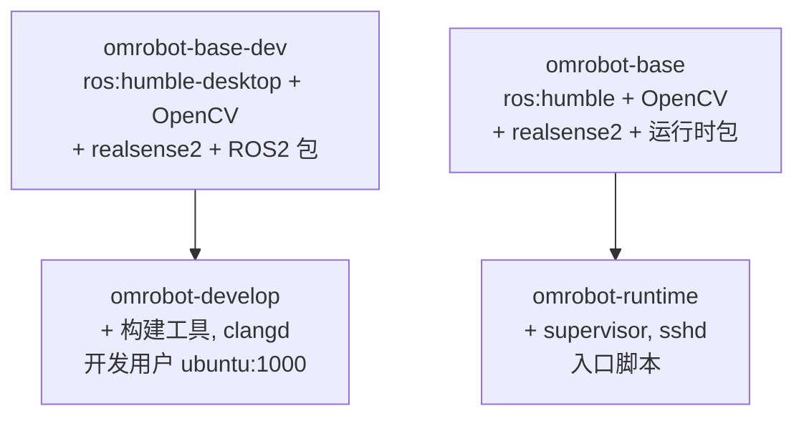
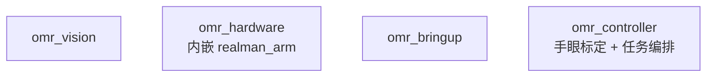
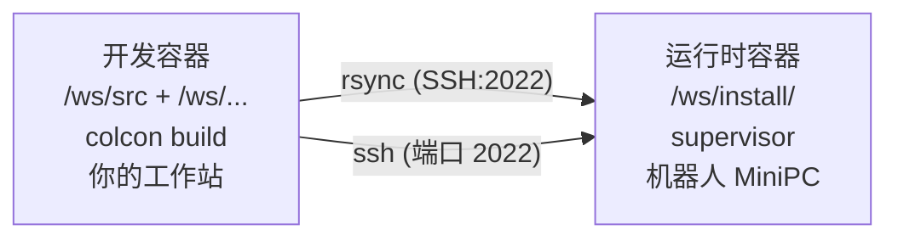
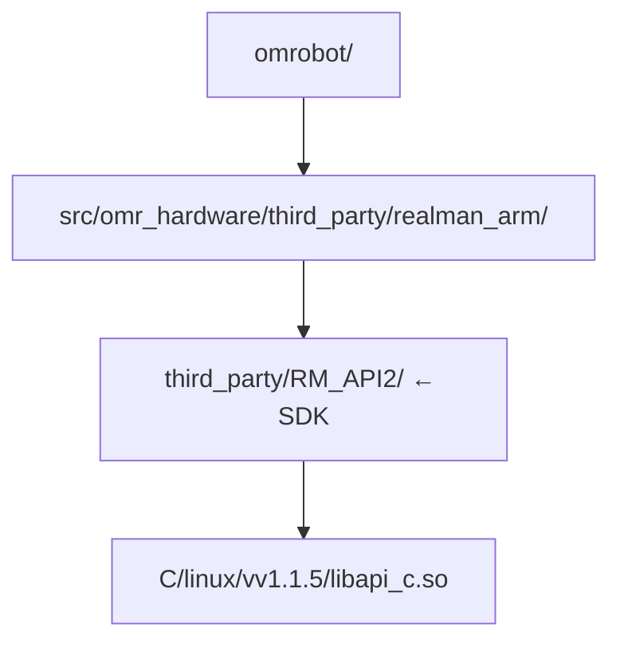

# 开发工作流 — OMRobot

构建、测试、调试和部署的日常参考手册。建议在阅读 [ONBOARDING.md](ONBOARDING.md) 之后阅读本文。

## 目录

1. [Docker 深入解析](#docker-深入解析)
2. [构建](#构建)
3. [测试](#测试)
4. [代码质量](#代码质量)
5. [调试](#调试)
6. [部署到机器人](#部署到机器人)
7. [CI/CD 流水线](#cicd-流水线)
8. [添加依赖](#添加依赖)
9. [更新 SDK](#更新-sdk)
10. [常见任务](#常见任务)

---

## Docker 深入解析

### 镜像阶段（Image Stages）

`Dockerfile` 共有四个阶段，按依赖链组织：



`base-dev` 与 `base` 的关键差异：

| | base-dev（开发） | base（运行时） |
|---|---|---|
| 基础镜像 | `osrf/ros:humble-desktop`（带 GUI） | `ros:humble`（无头） |
| ROS2 包 | 完整：rclcpp、tf2、geometry_msgs、hardware_interface、controller_manager、xacro、visualization_msgs 等 | 精简：rmw_cyclonedds、ament_cmake_test、ament_index_cpp、behaviortree_cpp、control_msgs |
| 大小 | ~3 GB | ~1.5 GB |
| rosdep | 未使用（显式 apt 安装） | 使用，带 `--skip-keys realman_arm omr_hardware` |

**为什么要拆分？** 开发镜像需要 GUI 工具（RViz）以及所有 ROS2 头文件以完成构建。
运行时镜像只需 `.so` 文件和 supervisor。分开构建能保持机器人部署体积小巧。

### 容器生命周期

```bash
# 构建镜像（首次构建或 Dockerfile 变更后）
docker compose build develop
docker compose build runtime

# 启动开发 Shell（前台、交互模式）
docker compose up develop

# 启动运行时容器（后台、自动重启）
docker compose up runtime -d

# 停止
docker compose stop runtime

# 重建并重启运行时
docker compose up runtime -d --build
```

### 卷挂载（Volume Mounts）

| 宿主机路径 | 容器路径 | 用途 |
|---|---|---|
| `.`（工作区根目录） | `/ws` | 源码 + 构建产物（开发） |
| `/dev` | `/dev` | 硬件访问（相机、串口、机械臂） |
| `/tmp/.X11-unix` | `/tmp/.X11-unix` | X11 转发供 RViz 使用（仅开发环境） |

运行时容器只挂载 `/dev` — 构建产物通过 rsync 同步到 `/ws/install/`。

### 代理处理

`docker compose` 从 `.env` 读取 `HTTP_PROXY` 和 `HTTPS_PROXY`，并将其作为构建参数和
环境变量传递。如果新增的工具在构建过程中需要联网（apt、pip、curl），请确保它能正确
使用这些环境变量。

---

## 构建

### 构建命令

```bash
# 标准构建（在 develop 容器内，工作目录 /ws）
colcon build

# 符号链接安装（Symlink install）— 重编译更快，适合开发阶段
colcon build --symlink-install

# 清理后重建
rm -rf build/ install/ log/
colcon build

# 构建指定包及其上游依赖
colcon build --packages-up-to omr_controller

# 仅构建指定包（不包含其下游依赖）
colcon build --packages-select omr_vision

# 带测试的构建
colcon build --cmake-args -DBUILD_TESTING=ON

# 带 clang-tidy 的构建（较慢，按需开启）
colcon build --cmake-args -DCMAKE_EXPORT_COMPILE_COMMANDS=ON -DCLANG_TIDY=ON

# 覆盖 SDK 路径（当 SDK 不在 /opt/realman-sdk 时）
colcon build --cmake-args -DREALMAN_SDK=/custom/path
```

### 构建顺序

`colcon build` 会自动解析依赖关系，但了解依赖链有助于理解整体结构：



`omr_bringup` 不含编译代码，但 `colcon build` 仍会处理其 `CMakeLists.txt` 以安装
launch/config/URDF 文件。

### clangd IntelliSense

构建完成后，重新生成 `compile_commands.json` 供 clangd 使用：

```bash
build-local              # colcon build + generate-compile-commands.sh
# 或手动执行：
generate-compile-commands.sh
```

这会将各包的 `compile_commands.json` 合并到工作区根目录的 `build/compile_commands.json`。
clangd 读取此文件以提供跳转到定义、诊断和补全功能。

`.clangd` 配置：
- 抑制 ROS2 系统头文件的告警（误报）
- 禁用 `UnusedIncludes`（ROS2 头文件触发过多）
- 使用 `--background-index` 加速符号查找

如果 clangd 报告系统头文件错误（`rclcpp/...`、`hardware_interface/...`），这是正常现象
— ROS2 头文件使用了大量复杂宏，clangd 难以处理。真正的编译错误会在 `colcon build`
中暴露出来。

---

## 测试

### 运行测试

```bash
# 带测试的构建
colcon build --cmake-args -DBUILD_TESTING=ON

# 运行所有测试
colcon test

# 运行指定包的测试
colcon test --packages-select omr_controller

# 显示测试输出（包括通过的测试）
colcon test-result --all --verbose

# 运行测试并在首次失败时中止
colcon test --return-code-on-test-failure
```

### 测试结构

| 包 | 测试可执行文件数 | 覆盖范围 |
|---|---|---|
| `omr_controller` | ~20 | arm_client、gripper_client、vision_client、motor_client、base_client、bt_factory、bt_xml、orchestrator、types、client_integration、orchestrator_integration、手眼标定求解器、TF 集成、端到端流水线、合成数据 |
| `omr_vision` | 待定 | 相机标定测试（原属于 realman_calibration） |
| `omr_hardware` | 0 | 尚无测试 |
| `omr_bringup` | 0 | 仅 launch/config |

### 编写测试

测试框架使用 `ament_cmake_gtest`。在 CMakeLists.txt 中添加 `BUILD_TESTING` 开关：

```cmake
if(BUILD_TESTING)
  find_package(ament_cmake_gtest REQUIRED)
  ament_add_gtest(my_test test/my_test.cpp)
  target_link_libraries(my_test ${PROJECT_NAME})
endif()
```

测试文件放在各包的 `test/` 目录下。参考 `src/omr_vision/test/` 和
`src/omr_controller/test/` 中的合成数据生成器和集成测试示例。

### Docker 测试环境

Docker 中测试需要设置 `RMW_IMPLEMENTATION=rmw_cyclonedds_cpp`（默认的
`rmw_fastrtps_cpp` 依赖共享内存，在容器中不可用）。此项已在 Dockerfile 中配置。

---

## 代码质量

### 格式化

代码风格：基于 Google 规范，4 空格缩进，100 列行宽限制。

```bash
# 检查格式（试运行，dry-run）
find src \( -name "*.cpp" -o -name "*.hpp" -o -name "*.h" \) \
    ! -path "*/third_party/*" | xargs clang-format --dry-run -Werror

# 应用格式化
find src \( -name "*.cpp" -o -name "*.hpp" -o -name "*.h" \) \
    ! -path "*/third_party/*" | xargs clang-format -i
```

CI 强制检查格式 — `clang-format --dry-run --Werror` 是阻断性的。如果 VS Code 中
设置了 `"editor.formatOnSave": true`（devcontainer 配置中已默认开启），保存时
会自动格式化。

### 静态分析

```bash
# 构建时运行 clang-tidy（按需开启，生成告警信息）
colcon build --cmake-args -DCLANG_TIDY=ON
```

clang-tidy 在 CI 中是非阻断性的（仅提供信息）。目标标准为 C++23，工具链为 GCC 11.4。
已启用的检查项见 `.clang-tidy`。

### 命名规范

| 类型 | 规范 | 示例 |
|---|---|---|
| 类 / 结构体 | `CamelCase` | `ArmSystem`、`CalibDataConfig` |
| 函数 / 方法 | `camelBack` | `moveJ()`、`pollState()` |
| 常量 / 枚举 | `UPPER_CASE` | `MAX_JOINTS`、`HandEyeMode::TSAI` |
| 命名空间 | `lower_case` | `rm`、`rm::calib` |
| 私有成员 | `trailing_` | `impl_`、`connected_` |

---

## 调试

### 构建失败排查

1. 仔细阅读错误信息 — CMake 错误虽然冗长但定位精确
2. 缺少 `ros-humble-*` 包？→ 在 Dockerfile 的 `apt-get install` 中添加
3. 缺少头文件？→ 检查 CMakeLists.txt 中的 `find_package()` 以及 package.xml 中的 `<depend>`
4. 链接错误？→ 检查 CMakeLists.txt 中的 `target_link_libraries()`

### 运行时调试

```bash
# 查看正在运行的节点
ros2 node list

# 查看话题
ros2 topic list
ros2 topic echo /joint_states

# 查看 TF 帧
ros2 run tf2_tools view_frames

# 查看控制器管理器状态
ros2 control list_hardware_interfaces
ros2 control list_controllers
```

#### Controller bringup 一致性检查（只读）

仅在操作者已安全启动所需真机 bringup 后执行以下命令。这些命令只查询状态，不发送轨迹、
Action 目标或速度命令。

```bash
# 确认每个 manager 都读取了与自身节点名匹配的参数根键。
ros2 param get /controller_manager update_rate
ros2 param get /dais_controller_manager update_rate
ros2 param get /m65_controller_manager update_rate

# 下列控制器都应处于 active 状态。
ros2 control list_controllers -c /controller_manager
ros2 control list_controllers -c /dais_controller_manager
ros2 control list_controllers -c /m65_controller_manager

# 检查上层接口和节点名称唯一性。
ros2 action list -t | sort
ros2 topic info /joint_states -v
ros2 node list | sort | uniq -d

# 在有限时间窗口内只读采样；也可按 Ctrl+C 提前结束。
timeout 10s ros2 topic echo /joint_states --field name
```

如果环境未安装可选的 `ros2controlcli`，因而没有 `ros2 control` 子命令，请改用以下等价的
只读服务。增加该可选运行时依赖由 Issue #48 跟踪，不属于本次控制器命名修复范围。

```bash
ros2 service call /controller_manager/list_controllers \
  controller_manager_msgs/srv/ListControllers "{}"
ros2 service call /dais_controller_manager/list_controllers \
  controller_manager_msgs/srv/ListControllers "{}"
ros2 service call /m65_controller_manager/list_controllers \
  controller_manager_msgs/srv/ListControllers "{}"
```

预期控制器：

| Manager | 状态广播器 | 命令控制器 |
|---|---|---|
| `/controller_manager` | `joint_state_broadcaster` | `joint_trajectory_controller` |
| `/dais_controller_manager` | `dais_joint_state_broadcaster` | `dais_joint_trajectory_controller` |
| `/m65_controller_manager` | `m65_joint_state_broadcaster` | `diff_drive_controller` |

六个控制器都应为 `active`。Action 列表必须同时包含
`/joint_trajectory_controller/follow_joint_trajectory` 和
`/dais_joint_trajectory_controller/follow_joint_trajectory`。重复节点检查命令应无输出。

三个状态广播器会有意向共享 `/joint_states` 分别发布相互交错的 `JointState` 消息。采样窗口
内 `name` 字段的并集应包含 `joint1`～`joint6`、`joint_dais`、`left_wheel_joint` 和
`right_wheel_joint`；不能假设单条消息同时包含所有子系统。`joint_dais` 的位置和速度单位为
米、米每秒。

仿真目前只实现 Arm 和 D-AIS ros2_control，不应期待 M65 controller。检查其共享的 Gazebo
manager：

```bash
ros2 control list_controllers -c /controller_manager
ros2 action list -t | sort
ros2 topic info /joint_states -v
ros2 node list | sort | uniq -d
```

仿真环境没有 `ros2controlcli` 时的等价命令为：

```bash
ros2 service call /controller_manager/list_controllers \
  controller_manager_msgs/srv/ListControllers "{}"
```

Arm/D-AIS 四个控制器都应为 `active`，并暴露与真机相同的两个 Action 名称。

### GDB

开发镜像已包含 GDB。调试特定可执行文件：

```bash
gdb --args ros2 run omr_controller calib_node
# 或调试测试：
gdb --args ./build/omr_controller/test_some_test
```

### Supervisor 日志（运行时）

在机器人上查看 supervisor 管理的进程日志：

```bash
ssh-remote <robot-ip>
supervisorctl status                # 查看所有进程状态
supervisorctl tail controller_manager  # 查看日志
supervisorctl restart controller_manager  # 如果卡住则重启
```

---

## 部署到机器人

### 架构



### 部署命令

```bash
# 步骤 1：同步构建产物
sync-remote 192.168.1.100

# 步骤 2（可选）：同步并重启服务
deploy-remote 192.168.1.100

# 步骤 3：SSH 登录调试
ssh-remote 192.168.1.100
```

执行过程：
1. `sync-remote` 通过 SSH 端口 2022 将 `/ws/install/` rsync 到 `root@<ip>:/ws/install/`
2. `deploy-remote` 完成相同操作后，再对 controller_manager 和 calib_node 执行 `supervisorctl restart`
3. Supervisor 在启动进程前先 source `/opt/ros/humble/setup.bash` 和 `/ws/install/setup.bash`

### 机器人首次部署设置

运行时容器需要在运行状态，且端口 2022 可访问：

```bash
# 在机器人 MiniPC 上执行：
docker compose up runtime -d
```

SSH 密钥对在构建时生成 — 开发容器的公钥已内置到运行时机器的 `authorized_keys` 中。
无需手动配置密钥。

### Foxglove 远程可视化

foxglove_bridge 已在 bringup 中默认启动（`launch_foxglove:=true`），WebSocket 端口 8765。

| 组件 | 版本 | 协议 |
|------|------|------|
| foxglove_bridge | 3.4.2 (foxglove-sdk-cpp 0.25.3) | `foxglove.sdk.v1` |
| Foxglove Studio | **≥ 2.56.0** | `foxglove.sdk.v1` |

> **注意**：旧版 Foxglove Studio (≤ 2.9.0) 使用 `foxglove.websocket.v1` 子协议，与 foxglove_bridge 3.x 不兼容，握手会返回 HTTP 400。请升级到 2.56.0+。

```bash
# 升级 Foxglove Studio
sudo apt update && sudo apt install foxglove-studio
```

连接 URL：`ws://<robot-ip>:8765`

---

## CI/CD 流水线

### ci.yml — Pull Request / 推送到 main

触发条件：推送到 `main`、PR 到 `main`

| 任务 | 操作 | 阻断性？ |
|---|---|---|
| Build & Test | 构建 develop 镜像 → `colcon build` → `colcon test` | 是 |
| Lint（clang-format） | 对所有源码执行 `clang-format --dry-run --Werror` | 是 |
| Lint（clang-tidy） | `colcon build -DCLANG_TIDY=ON` | 否（仅供参考） |

所有任务在 Docker 中使用 develop 镜像运行。工作区从挂载的 `src/` 目录构建。

构建缓存：通过 `type=gha` 实现 Docker 层缓存 — 如果 Dockerfile 和依赖未改变，后续
CI 运行会复用缓存的镜像层。

### cd.yml — 标签推送

触发条件：标签推送（`v*`）、手动触发

构建 `omrobot:develop` 和 `omrobot:runtime` 两个镜像，并将其推送到：

- `ghcr.io/chieftechlabs/omrobot-develop`（标签：`v1.2.3`、`sha-abc1234`、`latest`）
- `ghcr.io/chieftechlabs/omrobot-runtime`（标签：`v1.2.3`、`sha-abc1234`）

---

## 添加依赖

### 为包添加 ROS2 依赖

1. 在包的 `package.xml` 中添加 `<depend>package_name</depend>`
2. 在 `CMakeLists.txt` 中添加 `find_package(package_name REQUIRED)` 和 `ament_target_dependencies(... package_name)`
3. **同时也要在 Dockerfile 的所有相关阶段中添加对应的 `ros-humble-*` apt 包**：
- 构建依赖 → 添加到 `omrobot-base-dev`
- 运行时依赖 → 添加到 `omrobot-base`
   - Dockerfile 使用显式 `apt-get install` 而非 `rosdep`，因为 CI 环境中 `rosdep update` 会失败（DNS 无法解析 `raw.githubusercontent.com`）

4. 如果依赖在架构上具有重要性，更新 `AGENTS.md`

### 添加系统库

```dockerfile
# 在适当的 Dockerfile 阶段中：
RUN apt-get update && apt-get install -y --no-install-recommends \
    libfoo-dev \
    && rm -rf /var/lib/apt/lists/*
```

然后在 CMakeLists.txt 中：`find_package(Foo REQUIRED)`

### 添加 Python 包

对于 ROS2 launch 或脚本依赖，如果存在 `ros-humble-*` 形式的 apt 包，则通过 apt
安装；否则在 Dockerfile 中通过 pip 安装：

```dockerfile
RUN pip3 install some-package
```

---

## 更新 SDK

RealMan C SDK 是一个嵌套子模块：



更新步骤：

```bash
cd src/omr_hardware/third_party/realman_arm/third_party/RM_API2
git fetch
git checkout <tag-or-branch>
cd -  # 返回工作区根目录
git add src/omr_hardware/third_party/realman_arm/third_party/RM_API2
git commit -m "chore: update RM_API2 submodule to <version>"
```

重要提示：`.so` 路径中包含版本号（`vv1.1.5`）。如果版本号发生变化，请更新
Dockerfile 中的 `COPY` 命令。`realman_arm` 中的 CMake 配置使用 glob 发现
`.so` 文件，因此 CMake 应能自动检测到新路径 — 但建议检查
`src/omr_hardware/third_party/realman_arm/cmake/RealManSDKConfig.cmake` 以确认。

---

## 常见任务

### 添加新的 ROS2 节点

1. 创建 `src/my_package/src/my_node.cpp`
2. 在 `CMakeLists.txt` 中添加：
   ```cmake
   add_executable(my_node src/my_node.cpp)
   ament_target_dependencies(my_node rclcpp std_msgs)
   install(TARGETS my_node DESTINATION lib/${PROJECT_NAME})
   ```
3. 构建：`colcon build --packages-select my_package`
4. 运行：`ros2 run my_package my_node`

### 添加新的 launch 文件

1. 创建 `src/omr_bringup/launch/my_launch.launch.py`
2. 在 `CMakeLists.txt` 中添加：
   ```cmake
   install(DIRECTORY launch DESTINATION share/${PROJECT_NAME})
   ```
3. 构建：`colcon build --packages-select omr_bringup`
4. 运行：`ros2 launch omr_bringup my_launch.launch.py`

### 添加新的测试

1. 创建 `test/my_test.cpp`
2. 在 `CMakeLists.txt` 的 `if(BUILD_TESTING)` 块中添加：
   ```cmake
   ament_add_gtest(my_test test/my_test.cpp)
   target_link_libraries(my_test ${PROJECT_NAME})
   ```
3. 构建并运行：`colcon build --cmake-args -DBUILD_TESTING=ON && colcon test`

### 查看机器人状态

```bash
# 启动流水线（仅机械臂）
ros2 launch omr_bringup bringup.launch.py arm_ip:=192.168.1.18 launch_camera:=false launch_calib:=false

# 在容器内的另一个终端中：
ros2 topic echo /joint_states
ros2 topic echo /tf
```
