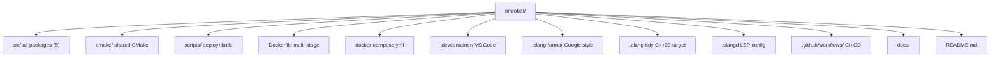
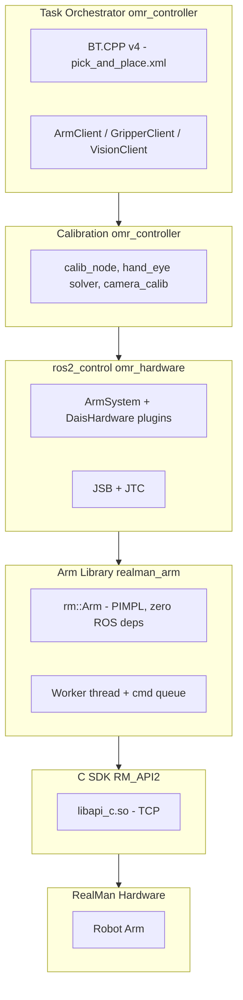

# Onboarding Guide — OMRobot

Welcome to the OMRobot project. This guide walks you from zero to
productive — setup, architecture, and your first contribution. It assumes you are
comfortable with C++ and Linux, but not necessarily with ROS2 or robotics.

## Table of Contents

1. [What We Build](#what-we-build)
2. [Prerequisites](#prerequisites)
3. [First Day Setup](#first-day-setup)
4. [Project Tour](#project-tour)
5. [Architecture at a Glance](#architecture-at-a-glance)
6. [Development Loop](#development-loop)
7. [Where to Go Next](#where-to-go-next)

---

## What We Build

OMRobot is a complete robot control system built on ROS2 Humble (Ubuntu 22.04),
integrating an M65 omnidirectional chassis, D-AIS linear rail, and [RealMan robot arms](https://www.realman-robot.com/) (RM65, RM75, ECO65, and others). The system includes:

- **Arm control** — a pure C++ library wrapping the RealMan C SDK, embedded in a
  `ros2_control` hardware interface
- **Computer vision** — RealSense D435 camera capture and OpenCV processing
- **Hand-eye calibration** — camera-to-arm coordinate frame calibration pipeline
- **Task orchestration** — behavior tree-based pick-and-place and inspection tasks
- **D-AIS motor control** — Modbus RTU driver for auxiliary linear actuators

The code runs in two environments:

| Environment | Purpose |
|---|---|
| **Develop container** (`omrobot:develop`) | GUI tools, RViz, building, testing — on your workstation |
| **Runtime container** (`omrobot:runtime`) | Headless, runs on the robot MiniPC — auto-starts controllers |

---

## Prerequisites

You need a machine running **Ubuntu 22.04** (native or VM) with:

- **Docker** and **Docker Compose** — we build and run everything in containers
- **Git** with an SSH key registered on GitHub — submodules use SSH
- **X11 server** (if you want RViz or GUI tools) — built into Ubuntu desktop;
  on Windows use VcXsrv; on macOS use XQuartz
- Basic familiarity with C++, CMake, and the Linux command line

You do **not** need ROS2 installed on your host — the Docker images include it.
You do **not** need the RealMan SDK — the Dockerfile copies it from the submodule.

Verify Docker works:

```bash
docker run hello-world
```

---

## First Day Setup

### 1. Clone the repository

```bash
git clone --recurse-submodules git@github.com:ChiefTechLabs/omrobot.git
cd omrobot
```

This pulls the main repo plus two nested submodules:

| Submodule | Path | Purpose |
|---|---|---|
| `realman_arm` | `src/omr_hardware/third_party/realman_arm/` | Pure C++ arm control library |
| `RM_API2` | `…/realman_arm/third_party/RM_API2/` | RealMan C SDK (nested) |
| `dais_motor` | `src/omr_hardware/third_party/dais_motor/` | Modbus RTU motor driver |

If you forget `--recurse-submodules`, run `git submodule update --init --recursive`
after cloning.

### 2. Configure proxy (if needed)

If you are behind a local proxy (Clash, v2ray, etc.), copy and configure:

```bash
cp .env.example .env
# Edit .env — set HTTP_PROXY and HTTPS_PROXY to your proxy address
```

### 3. Build the develop image

```bash
docker compose build develop
```

First build takes 5-10 minutes (downloads ROS2 Humble desktop image, compiles LLVM
toolchain). Subsequent builds use Docker cache and finish in seconds.

### 4. Enter the container

```bash
docker compose up develop
```

This drops you into a zsh shell at `/ws` with everything ready:
`/opt/ros/humble/setup.bash` is already sourced, the workspace is mounted, and
clangd is configured. Your host's `src/` directory is mounted at `/ws/src/` —
edit files on your host with your preferred editor, build inside the container.

Alternative: open in VS Code, run "Dev Containers: Reopen in Container" — the
`.devcontainer/devcontainer.json` uses the same docker-compose service and
auto-runs `build-local` after creation.

### 5. Build the workspace

Inside the develop container:

```bash
build-local
```

This runs `colcon build` and merges `compile_commands.json` for clangd IntelliSense.
The first build takes 2-5 minutes. Subsequent builds with `--symlink-install` (used
in CI) are faster.

### 6. Verify

```bash
# Check all packages built
ls install/

# Run tests (requires BUILD_TESTING)
colcon build --cmake-args -DBUILD_TESTING=ON
colcon test
```

---

## Project Tour

Walk through the key directories. Open them side-by-side with this guide.

### Top-level layout



### Packages under `src/`

| Package | Build system | Dependencies | What it does |
|---|---|---|---|---|
| `omr_vision` | ament_cmake | OpenCV, librealsense2 | RealSense D435 camera capture + calibration. No ROS deps. |
| `omr_hardware` | ament_cmake | realman_arm, dais_motor (submodules) | ros2_control hardware interface plugins: ArmSystem, DaisHardware |
| `omr_controller` | ament_cmake | omr_hardware, omr_vision, BehaviorTree.CPP | Task orchestrator: BT-based pick-and-place. Hand-eye calibration pipeline. |
| `omr_bringup` | ament_cmake | (launch/config only) | Launch files, URDF, controller configs |

Build order: `omr_vision` → `omr_hardware` → `omr_controller` → `omr_bringup`.
`colcon build` resolves this automatically.

### Key files to know

| File | Why you need it |
|---|---|
| `Dockerfile` | All four stages. If you add a ROS2 dependency, add the `ros-humble-*` apt package here. |
| `docker-compose.yml` | Container configuration. Volumes, devices, ports. |
| `scripts/supervisord.conf` | What auto-starts on the robot: `controller_manager` + `calib_node` |
| `src/omr_bringup/launch/bringup.launch.py` | Main launch file. Start here to understand the bringup. |
| `src/omr_bringup/config/realman_controllers.yaml` | Controller parameters (update rate, PID, joints) |
| `.devcontainer/devcontainer.json` | VS Code extensions and settings for the dev container |

---

## Architecture at a Glance

### The layers



### Key design decisions

**rm::Arm is not a ROS node.** It is a plain C++ class with zero ROS dependencies.
This means you can use it standalone, embed it in a ros2_control plugin, or link it
into any application. The PIMPL pattern (`Arm` → `Arm::Impl`) hides all SDK details
and the worker thread behind a clean public API.

**Single worker thread.** All arm commands (moveJ, moveL, gripper open/close, stop)
go through one `std::queue<std::function<void()>>` processed by a single worker
thread. This eliminates race conditions without needing mutexes on the command path.
Blocking commands use `std::condition_variable` to wait for completion.

**Lazy connection.** `rm_init()` runs at construction, but the actual TCP connection
is deferred to the first command. This lets you construct an `Arm` object without
hardware present — useful for testing and simulation.

**Radians in, degrees out.** The public API uses radians (ROS2 convention), but the
C SDK uses degrees. Conversion happens inside `Arm::Impl` — `motion.cpp` converts
on the way in, `state.cpp` converts on the way out. Always use radians in your code.

**C++23 with GCC 11.4.** We target C++23 but avoid features that require GCC 12+
(`std::expected`, `std::ranges::to`). Polyfills from the former `realman_calibration`
package (`expected_polyfill.hpp`, `format_polyfill.hpp`) remain in the migrated packages.

### Data flow

```
ArmSystem.read() → joint_state_broadcaster → /joint_states topic
/joint_states → joint_trajectory_controller (computes next command)
joint_trajectory_controller → ArmSystem.write() → rm::Arm::moveJ() → arm

TaskOrchestrator (20 Hz BT tick loop) → ArmClient (action goal) → JTC
                                        → VisionClient (camera + OpenCV detect)
                                        → GripperClient (gripper action)
```

---

## Development Loop

### The cycle

```
Edit code (on host) → Build (in container) → Test → Deploy (to robot)
```

### Building

Inside the develop container:

```bash
# Quick rebuild (only changed packages)
colcon build

# Full clean rebuild + compile_commands for clangd
build-local --clean

# Build with tests enabled
colcon build --cmake-args -DBUILD_TESTING=ON

# Build with clang-tidy (opt-in, slow)
colcon build --cmake-args -DCLANG_TIDY=ON
```

After editing `.cpp` or `.hpp` files, run `colcon build` from `/ws`. Only changed
packages and their dependents rebuild.

### Testing

```bash
# Build tests
colcon build --cmake-args -DBUILD_TESTING=ON

# Run all tests
colcon test

# Run a specific package's tests
colcon test --packages-select omr_controller

# See test output
colcon test-result --all --verbose
```

Test binaries need `LD_LIBRARY_PATH` pointing to the SDK — CMake handles this via
`APPEND_ENV`. In Docker, set `RMW_IMPLEMENTATION=rmw_cyclonedds_cpp` (already
configured in the Dockerfile) — the default `rmw_fastrtps_cpp` requires shared
memory not available in containers.

### Formatting

```bash
# Format all source (excludes third_party)
find src \( -name "*.cpp" -o -name "*.hpp" -o -name "*.h" \) \
    ! -path "*/third_party/*" | xargs clang-format -i
```

CI enforces formatting — the `clang-format --dry-run --Werror` check in CI is
blocking.

### Deploying to the robot

From the develop container, after building:

```bash
sync-remote <robot-ip>     # rsync install/ to runtime container (SSH port 2022)
deploy-remote <robot-ip>   # sync + restart services via supervisor
ssh-remote <robot-ip>      # SSH into the robot for debugging
```

The runtime container runs on the robot MiniPC with:
- `controller_manager` (ros2_control_node) — reads ArmSystem plugin, manages JSB+JTC
- `calib_node` (from omr_controller) — calibration service
- SSH server on port 2022 — receives artifacts from develop container
- Supervisor auto-restarts crashed processes

---

## Where to Go Next

After you have the workspace building and tests passing:

1. **Read [DEVELOPMENT.md](DEVELOPMENT.md)** — detailed development workflow:
   Docker stages explained, debugging techniques, CI/CD pipeline, adding
   dependencies, SDK updates

2. **Read [ARCHITECTURE.md](ARCHITECTURE.md)** — deep architecture reference:
   each package in detail, `rm::Arm` PIMPL design, worker thread internals,
   unit conversion patterns, ros2_control plugin design, behavior tree
   integration

3. **Explore the codebase** — start with these files in order:
   - `src/omr_bringup/launch/bringup.launch.py` — see what launches
   - `src/omr_hardware/src/arm_system.cpp` — hardware interface ↔ arm bridge
   - `src/realman_arm/include/realman/core/arm_facade.hpp` — `rm::Arm` public API
   - `src/omr_controller/apps/calib_node.cpp` — calibration ROS node

4. **Run an example on real hardware**:
   ```bash
   ros2 launch omr_bringup bringup.launch.py arm_ip:=192.168.1.18
   ```

5. **Pick a good first issue** — look for `good first issue` labels on GitHub
   or ask a teammate what needs work.

## Getting Help

- **Build issues**: Check the Dockerfile — missing `ros-humble-*` apt packages
  are the most common cause. If you added a `<depend>` in a `package.xml`, add
  the matching `ros-humble-*` package to the Dockerfile.
- **SDK issues**: Verify the submodule is initialized (`git submodule status`).
  The SDK `.so` path is versioned — check `CMakeLists.txt` in `realman_arm`.
- **Test failures**: Check `RMW_IMPLEMENTATION=rmw_cyclonedds_cpp` is set in Docker.
- **clangd not working**: Run `build-local` to regenerate `compile_commands.json`.
- **Deploy failures**: Verify SSH key is in `~/.ssh/authorized_keys` on the robot
  and port 2022 is reachable.
