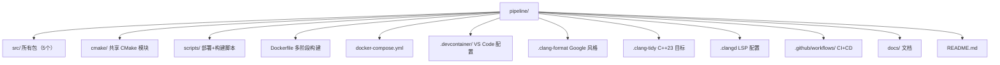
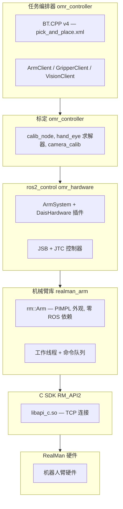

# 新人入门指南 — OMRobot

欢迎加入 OMRobot 项目。OMRobot 是一套完整的机器人控制系统，核心硬件采用 RealMan 机械臂（RM65、RM75、ECO65 等型号），集成了视觉感知、手眼标定、任务编排和辅助电机控制等模块。本文档带你从零开始，覆盖环境搭建、架构概览到你的第一次代码贡献。假设你熟悉 C++ 和 Linux，但不一定熟悉 ROS2 或机器人学。

## 目录

1. [我们做什么](#我们做什么)
2. [前置条件](#前置条件)
3. [第一天环境搭建](#第一天环境搭建)
4. [项目导览](#项目导览)
5. [架构速览](#架构速览)
6. [开发循环](#开发循环)
7. [下一步去哪](#下一步去哪)

---

## 我们做什么

OMRobot 是基于 ROS2 Humble（Ubuntu 22.04）的完整机器人控制系统，核心硬件采用 [RealMan 机器人臂](https://www.realman-robot.com/)（RM65、RM75、ECO65 等型号）。系统包含以下模块：

- **机械臂控制（Arm control）** — 封装 RealMan C SDK 的纯 C++ 库，嵌入在 `ros2_control` 硬件接口（hardware interface）中
- **计算机视觉（Computer vision）** — RealSense D435 相机采集与 OpenCV 图像处理
- **手眼标定（Hand-eye calibration）** — 相机到机械臂坐标系的手眼标定流程
- **任务编排（Task orchestration）** — 基于行为树（Behavior Tree）的抓取放置与检测任务
- **D-AIS 电机控制（Motor control）** — 辅助直线执行器的 Modbus RTU 驱动

代码在两个环境中运行：

| 环境 | 用途 |
|---|---|
| **开发容器（Develop container）** `realman:develop` | GUI 工具、RViz、构建、测试 — 在你的工作站上运行 |
| **运行时容器（Runtime container）** `realman:runtime` | 无头模式，运行在机器人 MiniPC 上 — 自动启动控制器 |

---

## 前置条件

你需要一台运行 **Ubuntu 22.04** 的机器（物理机或虚拟机），并具备：

- **Docker** 和 **Docker Compose** — 一切构建和运行都在容器（container）中完成
- **Git**，并在 GitHub 上注册了 SSH 密钥 — 子模块（submodule）使用 SSH
- **X11 服务**（如需 RViz 或其他 GUI 工具）— Ubuntu 桌面版自带；Windows 上用 VcXsrv；macOS 上用 XQuartz
- 基本掌握 C++、CMake 和 Linux 命令行

你**不需要**在宿主机上安装 ROS2 — Docker 镜像已内置。
你**不需要**安装 RealMan SDK — Dockerfile 会从子模块中拷贝。

验证 Docker 是否正常：

```bash
docker run hello-world
```

---

## 第一天环境搭建

### 1. 克隆仓库（Clone the repository）

```bash
git clone --recurse-submodules git@github.com:ChiefTechLabs/pipeline.git
cd pipeline
```

这会拉取主仓库及两个嵌套子模块：

| 子模块 | 路径 | 用途 |
|---|---|---|
| `realman_arm` | `src/omr_hardware/third_party/realman_arm/` | 纯 C++ 机械臂控制库 |
| `RM_API2` | `…/realman_arm/third_party/RM_API2/` | RealMan C SDK（嵌套子模块） |
| `dais_motor` | `src/omr_hardware/third_party/dais_motor/` | Modbus RTU 电机驱动 |

如果忘了加 `--recurse-submodules`，克隆后在仓库内执行：

```bash
git submodule update --init --recursive
```

### 2. 配置代理（如需要）

如果你在公司代理（Clash、v2ray 等）后面，请拷贝并配置：

```bash
cp .env.example .env
# 编辑 .env — 将 HTTP_PROXY 和 HTTPS_PROXY 设为你代理的地址
```

### 3. 构建开发镜像

```bash
docker compose build develop
```

首次构建约需 5–10 分钟（下载 ROS2 Humble 桌面版镜像，编译 LLVM 工具链）。后续构建会利用 Docker 缓存，几秒完成。

### 4. 进入容器

```bash
docker compose up develop
```

这会进入 `/ws` 目录下的 zsh shell，一切就绪：`/opt/ros/humble/setup.bash` 已自动 source，工作区已挂载，clangd 也已配置好。你宿主机的 `src/` 目录挂载在容器的 `/ws/src/` — 用你喜欢的编辑器在宿主机上编辑代码，在容器内构建。

替代方案：在 VS Code 中打开，运行 "Dev Containers: Reopen in Container" — `.devcontainer/devcontainer.json` 使用同一个 docker-compose 服务，并在创建后自动运行 `build-local`。

### 5. 构建工作区

在开发容器内：

```bash
build-local
```

这会执行 `colcon build` 并合并 `compile_commands.json` 供 clangd IntelliSense 使用。首次构建约需 2–5 分钟。后续使用 `--symlink-install`（CI 中使用）更快。

### 6. 验证

```bash
# 检查所有包是否已构建
ls install/

# 运行测试（需要 BUILD_TESTING）
colcon build --cmake-args -DBUILD_TESTING=ON
colcon test
```

---

## 项目导览

对照本文档，依次浏览关键目录。

### 顶层结构



### `src/` 下的包

| 包 | 构建系统 | 依赖 | 功能 |
|---|---|---|---|---|
| `omr_vision` | ament_cmake | OpenCV, librealsense2 | RealSense D435 相机采集 + 标定，无 ROS 依赖 |
| `omr_hardware` | ament_cmake | realman_arm, dais_motor（子模块） | ros2_control 硬件接口插件：ArmSystem、DaisHardware |
| `omr_controller` | ament_cmake | omr_hardware, omr_vision, BehaviorTree.CPP | 任务编排器：基于行为树的抓取放置 + 手眼标定流程 |
| `omr_bringup` | ament_cmake | （仅启动文件与配置） | 启动文件、URDF、控制器配置 |

构建顺序：`omr_vision` → `omr_hardware` → `omr_controller` → `omr_bringup`。
`colcon build` 会自动处理依赖顺序。

### 重要文件一览

| 文件 | 为什么需要关注 |
|---|---|
| `Dockerfile` | 全部四个阶段。如果你添加了 ROS2 依赖，在这里添加相应的 `ros-humble-*` apt 包。 |
| `docker-compose.yml` | 容器配置。卷挂载、设备映射、端口等。 |
| `scripts/supervisord.conf` | 机器上自动启动的内容：`controller_manager` + `calib_node` |
| `src/omr_bringup/launch/bringup.launch.py` | 主启动文件。理解系统启动流程从这里开始。 |
| `src/omr_bringup/config/realman_controllers.yaml` | 控制器参数（更新频率、PID、关节） |
| `.devcontainer/devcontainer.json` | 开发容器的 VS Code 扩展和设置 |

---

## 架构速览

### 分层架构



### 关键设计决策

**rm::Arm 不是 ROS 节点。** 它是一个纯 C++ 类，零 ROS 依赖。这意味着你可以独立使用它，嵌入到 ros2_control 插件中，或链接到任何应用中。PIMPL 模式（`Arm` → `Arm::Impl`）将所有 SDK 细节和工作线程隐藏在清晰的公开 API 之后。

**单一工作线程。** 所有机械臂命令（moveJ、moveL、夹爪开合、停止）都通过一个 `std::queue<std::function<void()>>`，由单一工作线程串行处理。这消除了命令路径上的竞态条件（race condition），无需互斥锁。阻塞命令使用 `std::condition_variable` 等待完成。

**延迟连接（Lazy connection）。** `rm_init()` 在构造时执行，但实际的 TCP 连接推迟到第一条命令。这使得你可以在没有硬件的情况下构造 `Arm` 对象 — 对测试和仿真非常有用。

**公开 API 用弧度，内部用度。** 公开 API 使用弧度（ROS2 惯例），但 C SDK 使用度。转换发生在 `Arm::Impl` 内部 — `motion.cpp` 在送入时转换，`state.cpp` 在输出时转换。在你的代码中请始终使用弧度。

**C++23 + GCC 11.4。** 目标标准为 C++23，但避免需要 GCC 12+ 的特性（`std::expected`、`std::ranges::to`）。补丁（polyfill）原位于 `realman_calibration`（`expected_polyfill.hpp`、`format_polyfill.hpp`），迁移后仍保留在各包中。

### 数据流

```
ArmSystem.read() → joint_state_broadcaster → /joint_states 话题
/joint_states → joint_trajectory_controller（计算下一条指令）
joint_trajectory_controller → ArmSystem.write() → rm::Arm::moveJ() → 机械臂

TaskOrchestrator（20 Hz BT tick 循环） → ArmClient（action goal）→ JTC
                                         → VisionClient（相机 + OpenCV 检测）
                                         → GripperClient（夹爪 action）
```

---

## 开发循环

### 开发周期

```
编辑代码（宿主机） → 构建（容器内） → 测试 → 部署（到机器人）
```

### 构建

在开发容器内：

```bash
# 快速重构建（仅变更的包）
colcon build

# 完整清理重构建 + compile_commands（供 clangd 使用）
build-local --clean

# 带测试的构建
colcon build --cmake-args -DBUILD_TESTING=ON

# 带 clang-tidy 的构建（可选开启，较慢）
colcon build --cmake-args -DCLANG_TIDY=ON
```

编辑 `.cpp` 或 `.hpp` 文件后，在 `/ws` 下执行 `colcon build`。仅变更的包及其依赖会重新构建。

### 测试

```bash
# 构建测试
colcon build --cmake-args -DBUILD_TESTING=ON

# 运行全部测试
colcon test

# 运行指定包的测试
colcon test --packages-select omr_controller

# 查看测试输出
colcon test-result --all --verbose
```

测试二进制文件需要 `LD_LIBRARY_PATH` 指向 SDK — CMake 通过 `APPEND_ENV` 自动处理。在 Docker 中，需设置 `RMW_IMPLEMENTATION=rmw_cyclonedds_cpp`（Dockerfile 已预设）— 默认的 `rmw_fastrtps_cpp` 需要共享内存，容器中不可用。

### 格式化

```bash
# 格式化所有源文件（排除 third_party）
find src \( -name "*.cpp" -o -name "*.hpp" -o -name "*.h" \) \
    ! -path "*/third_party/*" | xargs clang-format -i
```

CI 会强制检查格式 — CI 中的 `clang-format --dry-run --Werror` 是阻断性的。

### 部署到机器人

在开发容器中，构建完成后：

```bash
sync-remote <robot-ip>     # rsync install/ 到运行时容器（SSH 端口 2022）
deploy-remote <robot-ip>   # 同步 + 通过 supervisor 重启服务
ssh-remote <robot-ip>      # SSH 进入机器人进行调试
```

运行时容器运行在机器人 MiniPC 上，包含：
- `controller_manager`（ros2_control_node）— 读取 ArmSystem 插件，管理 JSB+JTC
- `calib_node`（来自 omr_controller）— 标定服务
- SSH 服务器监听 2022 端口 — 接收来自开发容器的构建产物
- Supervisor 自动重启崩溃的进程

---

## 下一步去哪

在成功构建工作区并通过全部测试之后：

1. **阅读 [开发工作流](DEVELOPMENT_CN.md)** — 详细开发流程：Docker 构建阶段详解、调试技巧、CI/CD 流水线、添加依赖、SDK 更新

2. **阅读 [架构参考](ARCHITECTURE_CN.md)** — 深入架构参考：各包详述、`rm::Arm` PIMPL 设计、工作线程内部机制、单位转换模式、ros2_control 插件设计、行为树集成

3. **浏览代码库** — 按以下顺序阅读关键文件：
   - `src/omr_bringup/launch/bringup.launch.py` — 了解启动了什么
   - `src/omr_hardware/src/arm_system.cpp` — 硬件接口 ↔ 机械臂的桥梁
   - `src/realman_arm/include/realman/core/arm_facade.hpp` — `rm::Arm` 公开 API
   - `src/omr_controller/apps/calib_node.cpp` — 标定 ROS 节点

4. **在真实硬件上运行示例**：
   ```bash
   ros2 launch omr_bringup bringup.launch.py arm_ip:=192.168.1.18
   ```

5. **选一个合适的入门任务** — 在 GitHub 上查找 `good first issue` 标签，或询问同事有什么可以做的。

## 获取帮助

- **构建问题**：检查 Dockerfile — 缺少 `ros-humble-*` apt 包是最常见的原因。如果在 `package.xml` 中新增了 `<depend>`，别忘了在 Dockerfile 中添加对应的 `ros-humble-*` 包。
- **SDK 问题**：确认子模块已初始化（`git submodule status`）。SDK `.so` 路径是版本化的 — 检查 `realman_arm` 中的 `CMakeLists.txt`。
- **测试失败**：确认 Docker 中设置了 `RMW_IMPLEMENTATION=rmw_cyclonedds_cpp`。
- **clangd 不工作**：运行 `build-local` 重新生成 `compile_commands.json`。
- **部署失败**：确认 SSH 密钥已在机器人 `~/.ssh/authorized_keys` 中，且 2022 端口可达。
